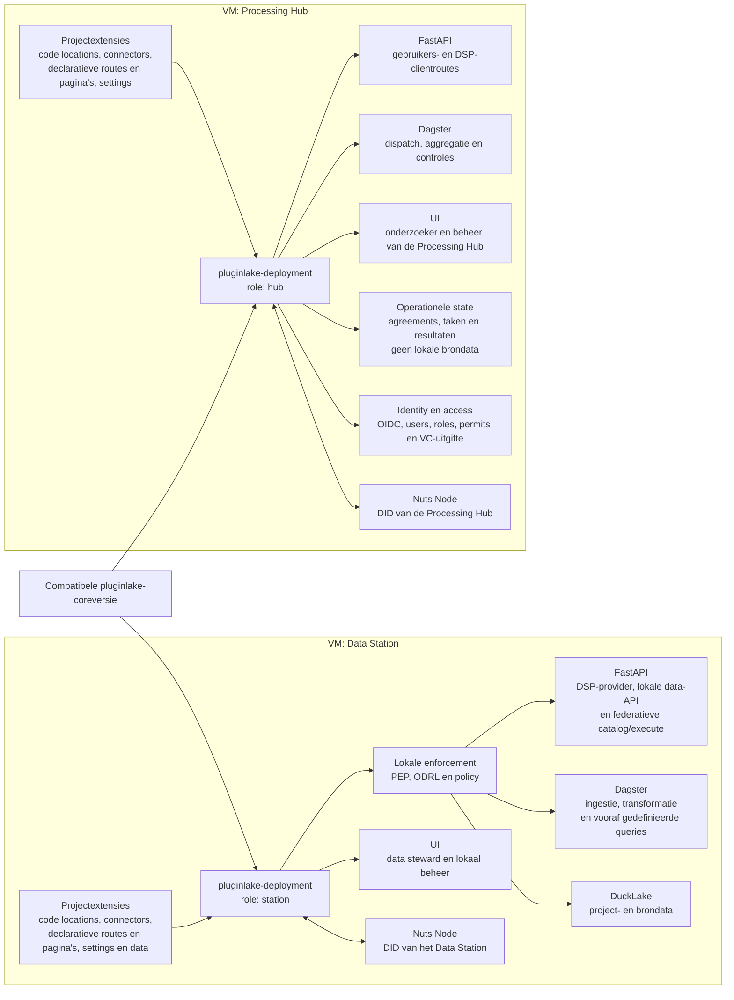
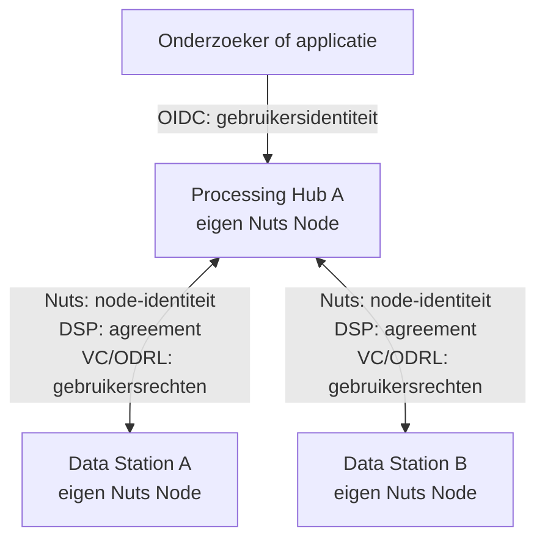

# Pluginlake: status en ontwikkelfasen

Pluginlake is een federatief gezondheidsdataplatform:

- lakehouse met dagster + ducklake als basis.
- dezelfde core deployment kan als Data Station of als Processing Hub draaien, alleen andere configuratie.
- projecten voegen capabilities toe aan een deployment, ze forken de core niet.
- open source tools en open standaarden (OMOP, FHIR, DSP, ODRL, Nuts) op alle lagen.

Dit document geeft een overzicht van features die beschreven worden in de docs/ADRs, code en PRs/issues.

## Huidige status

- de technische basis (python package tooling, dagster, ducklake, fastapi, docker) draait lokaal.
- OMOP- en FHIR-ingestie, transformaties, API's en dashboards werken als prototype op één station.
- split tussen platformcode en projectcode staat in review in [#144](https://github.com/plugin-healthcare/pluginlake/pull/144) -> dit is de belangrijkste openstaande structuurwijziging.
- de federatieve kant (Nuts, DSP, credentials, ODRL, controlled compute) leeft in ADRs maar nog nauwelijks gebouwd.
- productie deployment is ook onvoldoende uitgewerkt en opgezet, op dit moment gelimiteerd tot local deployment via docker compose.
- PLUGIN platform applicaties: pluginanalytics, pluginhub en mogelijk pluginml zitten boven op de componenten van pluginlake met eigen UI, assets/code locations en API.

### Deploymentmodel

Elke node in het netwerk heeft een pluginlake-deployment op een compatibele coreversie. Die deployment wordt geconfigureerd voor zijn rol en daar komen projectonderdelen bovenop: dagster code locations, connectors, declaratieve routes en UI-pagina's, en eigen settings. De IO manager en het aanhaken van de catalog blijven van de core. ADR-009 splitst dat in twee planes: de federatieve plane blijft uniform en een project voegt daar alleen geregistreerde operations en predefined queries toe, nooit nieuwe externe endpoints. De lokale operatorplane is wel projectspecifiek. Bron- en projectdata staan alleen op Data Stations. Een project krijgt geen eigen platformdeployment en geen afwijkende core, want dan kunnen de nodes niet meer met elkaar praten. Een project kan zowel ook op meerdere data stations als onderdeel van een samenwerking/federation worden deployed via configuratie.

Data Station en Processing Hub delen dezelfde basis: FastAPI, Dagster, een Nuts Node en een UI. De invulling verschilt. Het station heeft lokale opslag, ingestie, compute en policy enforcement. De hub heeft geen brondata en doet authenticatie, gebruikersbeheer, dispatch, aggregatie, SDC en integriteitscontroles. In productie zijn dat gescheiden instances, colocatie is alleen voor dev en test.

### Vertrouwenslagen

Iedere pluginlake-instance (datastation en processing hub) heeft een eigen Nuts Node en DID. Nuts doet node-to-node op instance- en organisatieniveau, daar bovenop komen pas de gebruikersrechten. Zo kun je node-grenzen en gebruikersrechten los van elkaar afdwingen.

1. **OIDC**: bewijst wie de onderzoeker of applicatie is richting de Processing Hub. Die bundelt zelf een OIDC-provider die op een institutionele IdP kan federeren, programmatic access loopt via een API key met OIDC pre-auth.
2. **Nuts**: bewijst welke Processing Hub en welk Data Station met elkaar praten, op instance- en organisatieniveau.
3. **DSP-agreement**: de contractuele buitengrens tussen die twee nodes.
4. **VC met ODRL-permissions**: de fijnmazige rechten van die specifieke gebruiker binnen dat contract.
5. **Het Data Station** valideert alles hierboven, combineert het met lokaal beleid en houdt de finale beslissing. Een Processing Hub kan niets afdwingen wat het Data Station niet zelf accepteert.

## Platform development fases

De ADRs lopen op dit moment ver voor op de code. Onderstaande fasering is bedoeld om volgorde aan te brengen in de features uit de ADRs. Het is belangrijk dat we eerst in kaart brengen wat nodig is voor een stabiel eerste basis platform voor het opzetten van POCs.

| Fase | Resultaat |
|:---|:---|
| **0. Core foundation** | Reproduceerbare core runtime, projectcontract, lokale dev stack en kwaliteitsgate. |
| **1. Standalone Data Station** | Eén station kan ingesteren, valideren, transformeren, catalogiseren en lokaal ontsluiten. |
| **2. Data Station + Processing Hub PoC** | Eén Data Station en één Processing Hub gebruiken ieder hun eigen Nuts-identiteit in een minimale netwerkflow op synthetische data. |
| **3. Governed federation** | De Processing Hub verleent fine-grained toegang, meerdere Data Stations handhaven permits, beleid, begrensde queries en SDC. |
| **4. Production federation** | Geschikt voor echte gezondheidsdata binnen vastgestelde juridische en operationele kaders. |
| **5. Advanced profiles** | Containers, federated ML, realtime en eventuele Europese uitwisseling, elk met een eigen dreigingsmodel. |

Fase 4 is de harde gate: alles wat met echte patiëntdata te maken heeft valt daar of daarna. Fase 5 is expliciet apart gehouden omdat elk van die profielen een eigen securityvraagstuk is en niet in de basis thuishoort.

De eerste zes lijsten zijn platformwerk: functionaliteit die iedere deployment krijgt, ongeacht welk project erop draait. De laatste lijst is projectwerk: datadomeinen en mappings die per project verschillen en die bovenop het platform komen. Die scheiding is precies wat [#144](https://github.com/plugin-healthcare/pluginlake/pull/144) in de code doorvoert.

### Core platform

| Feature | Status | Complexiteit | Fase |
|:---|:---|:---|:---|
| Core library (Pydantic Settings, logging, utils): gedeelde bouwstenen voor elk onderdeel | Klaar voor waar we nu zijn | Laag | 0 |
| Dagster orchestratie: pipelines draaien, projectcode als aparte code location | Deels, de runtime werkt, het laden van projectcode staat in review in [#144](https://github.com/plugin-healthcare/pluginlake/pull/144) | Hoog | 0 |
| DuckLake catalog (DuckDB + Postgres): elke schrijfactie loopt via de catalogus | Deels, lezen en schrijven werkt, lifecycle en foutafhandeling zijn onvolledig | Hoog | 0 |
| Custom DuckLake IO manager (Polars lazy in en uit DuckDB): assets lezen en schrijven zonder in Python te materialiseren | Klaar voor de huidige assets. Lazy loading met pushdown werkt, maar `handle_output` doet altijd `CREATE OR REPLACE TABLE`, dus geen incrementeel schrijven en geen echte streaming van datasets groter dan het geheugen | Hoog | 0/3 |
| Asset wrapper die tabulaire data verplicht via DuckLake laat lopen, met een expliciete uitweg voor niet-tabulaire output | Niet gestart. Vandaag zet elke code location zijn eigen `resources={"io_manager": ...}`, dus **de route via DuckLake is conventie en geen afdwinging** | Gemiddeld | 1 |
| Asset- en schemaconventies: voorspelbare indeling en naamgeving van datasets | Deels, de hoofdroute werkt maar documentatie en werkelijkheid lopen uiteen | Gemiddeld | 0 |
| FastAPI gateway als PEP: enige ingang naar het platform, dwingt beleid af | Deels, de routes werken, maar **de gateway dwingt nog geen beleid af** | Hoog | 1 |
| Docker Compose dev-stack: het hele platform lokaal draaien | Klaar voor dev en PoC, niet voor productie | Gemiddeld | 0 |
| ProjectManifest + conformance suite: projecten declareren wat ze toevoegen, gevalideerd bij opstarten | In review in [#144](https://github.com/plugin-healthcare/pluginlake/pull/144), een project declareert wat het toevoegt maar **het platform weigert nog niets** | Hoog | 0 |
| Project scaffolding CLI: nieuw project met een eigen catalog als datagrens | In review in [#144](https://github.com/plugin-healthcare/pluginlake/pull/144), de catalog per project is nog geen echte datagrens | Hoog | 0/1 |
| Connector-laag: databronnen aansluiten los van de orchestrator | Deels in review in [#144](https://github.com/plugin-healthcare/pluginlake/pull/144) | Hoog | 1 |
| Noderol als config (`role: station` of `role: hub`): één codebase, twee rollen | Niet gestart, alleen ontworpen | Hoog | 2 |
| Partitionering en pruning: een query leest alleen de relevante partities | Niet gestart, wel ontworpen | Gemiddeld | 1 |
| Postgres metadata-backend: state voor Dagster en de DuckLake-catalogus | Klaar voor lokaal gebruik, geen productievariant | Gemiddeld | 0/4 |
| S3-compatible object storage: data weg van de lokale schijf | Deels beschreven, niet in gebruik | Hoog | 4 |
| Container registry: eigen images bouwen en distribueren | Deels beschreven, geen werkende pijplijn | Hoog | 4 |

### Data Station

| Feature | Status | Complexiteit | Fase |
|:---|:---|:---|:---|
| Ingestie-API met pipeline-trigger: aanleveren start automatisch verwerking | Deels, de basisflow werkt, veilige verwerking en betrouwbare statusterugkoppeling ontbreken | Gemiddeld | 1 |
| Two-stage validatie: schemacheck bij aanlevering, kwaliteitscheck in de pipeline | Deels, de eerste stap werkt, kwaliteitsscoring en het apart zetten van afgekeurde data ontbreken | Gemiddeld | 1 |
| Dagster sensors: nieuwe aanleveringen automatisch oppikken | Klaar als prototype | Gemiddeld | 1 |
| Streaming-ingestielane (broker plus standing ingestion service): events uit operationele bronsystemen opvangen buiten de OLAP-engine om | Niet gestart, ontworpen in [#142](https://github.com/plugin-healthcare/pluginlake/pull/142). Brokerkeuze (RabbitMQ, Kafka, NATS) is nog open | Hoog | 4 |
| Landing zone als raw dump plus readability gate naar bronze: Dagster blijft batch en wordt op cadans getriggerd, nooit per event | Niet gestart, wel ontworpen. **DuckLake is geen streaming sink**, dus sub-seconde serving hoort expliciet niet bij het lake maar bij een aparte laag | Hoog | 4 |
| Lokale data-API: catalogus, data en samenvattende statistiek opvragen | Deels, de routes werken, foutafhandeling en begrenzing van queries ontbreken | Gemiddeld | 1 |
| Streamlit data steward UI: lokaal beheer en inzicht in de eigen data | Klaar als prototype | Gemiddeld | 1 |
| Niet-tabulaire data (beeld, PDF, DICOM, vrije tekst): blobs in object storage met alleen metadata en verwijzing in de catalogus | Niet gestart. Alles gaat nu uit van tabulaire data; er is geen opslagcontract, geen metadatamodel en geen manier om zulke objecten in een asset op te nemen | Hoog | 4/5 |

### Processing Hub

De Processing Hub is de federatieve runtime: geen eigen brondata, wel authenticatie, autorisatie, verificatie, uitzetten van vragen, aggregatie, SDC en integriteitscontroles. Van dat hele plaatje staat nu alleen een UI-prototype.

| Feature | Status | Complexiteit | Fase |
|:---|:---|:---|:---|
| Processing Hub runtime: federatieve node zonder eigen brondata | Deels, **alleen een statusoverzicht en simpele aggregatie werken als prototype** | Hoog | 2/3 |
| Federatieve catalogus: welke datasets bij welk Data Station staan | Niet gestart, wel ontworpen | Hoog | 3 |
| Predefined queries en query-builder: vragen stellen zonder eigen SQL | Niet gestart, de UI heeft alleen een placeholder | Hoog | 3 |
| Query dispatch en aggregatie: uitzetten bij meerdere stations, deelresultaten samenvoegen | Niet gestart, het patroon is beschreven | Hoog | 3 |
| Resultaatcache met TTL: resultaten tijdelijk bewaren en automatisch opruimen | Niet gestart, wel ontworpen | Gemiddeld | 3 |
| Async jobs met tokenverlenging: langlopende queries verlopen niet halverwege | Niet gestart, wel ontworpen | Gemiddeld | 3 |
| Privacychecks per resultaat (k-anonymity, cardinaliteitslimieten): controle op de uitkomst van één query | Niet gestart, wel ontworpen als post-execution validatie in Polars op de Processing Hub | Gemiddeld | 3 |
| Statistical Disclosure Control over queries heen: bijhouden wat een onderzoeker cumulatief heeft opgevraagd, zodat losse toegestane antwoorden samen geen individu blootleggen | Niet gestart. **Dit is het echte werk**, niet de celonderdrukking zelf. De Processing Hub moet alle queries van zijn onderzoekers over al zijn samenwerkingen volgen (ADR-006) | Hoog | 3 |
| Gebundelde OIDC-provider (Keycloak, Authentik of Zitadel): onderzoekers loggen in op de Processing Hub | Niet gestart, simpele operatorauth volstaat in fase 2, institutionele login pas in fase 3. **Productkeuze is nog open**, ADR-008 noemt alleen Keycloak en Authentik | Hoog | 2/3 |
| M2M-toegang via dezelfde OIDC-provider (service accounts, `client_credentials`): scripts en clients zonder browser | Niet gestart. ADR-008 beschrijft dit als API key met OIDC pre-auth, maar dat is geen apart tokensysteem: het valt onder dezelfde provider. **Geldt alleen voor gebruiker naar Processing Hub**, node-to-node loopt via Nuts | Gemiddeld | 3 |
| RBAC en gebruikersbeheer: wie mag welke query op welke data | Niet gestart, wel ontworpen | Hoog | 3/4 |
| Output checking: resultaten pas vrijgeven na beoordeling | Niet gestart, wel ontworpen | Hoog | 3/4 |

### Federatie en trust

| Feature | Status | Complexiteit | Fase |
|:---|:---|:---|:---|
| Nuts node met eigen DID: elke node een eigen organisatie-identiteit | Niet gestart, geldt voor Data Stations én Processing Hubs | Hoog | 2 |
| NutsOrganizationCredential: verifieerbaar bewijs dat een partij in het netwerk hoort | Niet gestart, uitgifte en beheer zijn nog open | Hoog | 2 |
| Nuts discovery service: nodes vinden elkaar binnen het netwerk | Niet gestart, loopt via de discovery-dienst van de netwerkbeheerder | Gemiddeld | 2 |
| OAuth2 access tokens via Nuts: validatie per request | **Correctie nodig in ADR-006**, de beschreven versie en tokenflow passen niet bij elkaar | Gemiddeld | 2 |
| DSP catalog met ODRL offer: wat een Processing Hub bij een station mag opvragen | Niet gestart, wel ontworpen | Hoog | 2 |
| DSP contract negotiation: node-to-node afspraak vastleggen voor toegang | Niet gestart, de kant van het station is uitgebreid beschreven | Hoog | 2 |
| DSP transfer process: data ophalen onder een gesloten contract | Niet gestart, wel ontworpen | Hoog | 2 |
| DSP consumer: de aanvragende kant van het protocol op de Processing Hub | Niet gestart, fase 2 kan met een simpele testclient | Hoog | 2/3 |
| ODRL-permissions in een VC: rechten van één onderzoeker meegeven aan een verzoek | Niet gestart. De Processing Hub verleent, het Data Station toetst en handhaaft lokaal | Hoog | 3 |
| Ingebouwde ODRL-evaluator op het station (geen OPA): lokale handhaving en finale beslissing | Niet gestart, de aanpak is ontworpen maar de precieze regels ontbreken | Hoog | 3 |
| Scope-vocabulaire: welke datasets en operaties een permission kan raken | Niet gestart, bewust pas na de PoC | Hoog | 3 |
| Revocatie: credentials, contracten en resultaten kunnen intrekken | Bewust uitgesteld tot de federatieve flow bestaat | Hoog | 3 |
| Multi-federatie governance: SDC en identiteiten over meerdere hubs heen | **Correctie nodig**, gescheiden identiteiten voorkomen niet dat resultaten gecombineerd worden. SDC klopt bovendien alleen op complete resultaten: twee groepen van 2 en 3 zijn samen een veilige groep van 5, maar worden onderdrukt als elk station los filtert | Hoog | 3 |
| Versiecompatibiliteit: nodes op verschillende releases blijven samenwerken | Niet gestart, wel ontworpen | Gemiddeld | 3 |

### Applicaties en compute

| Feature | Status | Complexiteit | Fase |
|:---|:---|:---|:---|
| Project-plugins: een project toevoegen aan een deployment zonder de core te forken | In review in [#144](https://github.com/plugin-healthcare/pluginlake/pull/144), data blijft op Data Stations | Hoog | 1 |
| pluginhub: applicatie voor data-uitwisseling van een Data Station naar een andere machine en voor downloads | Niet gestart, alleen als aanbeveling beschreven | Hoog | 3 |
| pluginanalytics: applicatie voor federatieve SQL-queries over meerdere Data Stations | Niet gestart, op hoofdlijnen ontworpen | Hoog | 3 |
| pluginml als databron-consument: aansluiten op een pluginlake-deployment | Niet uitgewerkt, genoemd als mogelijkheid maar de koppeling ligt nergens vast | Hoog | 3 |
| vantage6 federated learning: modellen trainen zonder data te verplaatsen | Extern al in productie, **de aansluiting op onze eigen identiteit en outputcontroles is nog open** | Hoog | 3/4 |
| Query whitelisting: alleen goedgekeurde queries met begrensde filters | Bewust uitgesteld tot na de netwerk-PoC | Hoog | 3 |
| Container runtime isolation (gVisor/Kata, read-only volumes, resource limits): code draaien naast patiëntdata zonder dat die code eruit kan | Onderzocht, isolatieniveau per use case is nog niet gekozen | Hoog | 5 |
| Graduated validation levels 0-4 (registry, cosign, SBOM, digest pinning, SLSA): hoe streng een algoritme-image wordt gecontroleerd voor het mag draaien | Onderzocht, de niveaus staan beschreven maar er is geen toelatingsbeleid dat ze afdwingt | Hoog | 5 |
| HealthData@EU-aansluiting: Europese uitwisseling van gezondheidsdata | Toekomstoptie, alleen relevant bij een concrete aansluiting | Hoog | 5 |
| Andere dataspaces (KIK-V, EDC, iSHARE, Gaia-X): interoperabiliteit buiten dit netwerk | Onderzocht, geen keuze gemaakt | Hoog | 5 |

### Assurance en operations

| Feature | Status | Complexiteit | Fase |
|:---|:---|:---|:---|
| Authenticatie op alle endpoints: geen open interne services | **Niet klaar, de authenticatie laat nu alles door en interne diensten zijn van buiten bereikbaar** | Hoog | 1/2 |
| Secrets- en sleutelbeheer: opslag en rotatie van keys en certificaten | Niet gestart als productieprofiel | Hoog | 4 |
| Append-only audit log: wie deed wat op welke grondslag | Deels, er wordt gelogd, maar niet gekoppeld aan wie wat op welke grond deed | Hoog | 3/4 |
| Health checks met Prometheus/Grafana: zien of een node gezond is en alarmeren | Deels ontworpen, de readiness-check is nog een lege huls | Hoog | 2/4 |
| Rate limiting: begrenzing van gelijktijdige verzoeken per aanvragende node | Niet gestart, wel ontworpen met limieten per aanvragende node | Gemiddeld | 3/4 |
| Column-level lineage (OpenLineage + Marquez): tracking tussen datasets tot op kolomniveau | Ontworpen in ADR-007, niet geïmplementeerd | Hoog | 3 |
| Catalogusintegriteit: bewaken dat catalogus en onderliggende opslag niet uit elkaar lopen | Niet gestart, niets controleert vandaag of elk bestand waar de catalogus naar verwijst er nog is | Hoog | 3 |
| Fail-fast datavalidatie: de keten stopt op data die niet aan het contract voldoet | Deels, er wordt gevalideerd bij ingestie, maar een mislukte controle stopt de keten niet altijd | Hoog | 3 |
| Retentiebeleid: bewaartermijnen, opruimen en het afsluiten van een project | Bewust uitgesteld, een eigen catalog per project is eerst nodig | Hoog | 4 |
| Back-up en restore: catalogus en opslag terug kunnen zetten | Niet gestart, wel bekend wat er in de back-up hoort | Gemiddeld | 4 |
| Dependency scanning als CI-gate: kwetsbare packages blokkeren voor merge | Deels, updates worden gevolgd maar niets blokkeert een PR | Hoog | 3/4 |
| SBOM (syft) en signing (cosign/sigstore): aantonen wat er in een release zit en van wie die komt | Niet gestart, geen SBOM en geen ondertekening | Hoog | 3/4 |
| Whitelisting van projectcode en config: alleen gecureerde plugins worden geladen | Niet gestart, **een deployment kan nu nog willekeurige code installeren** | Hoog | 3/4 |
| Productiedeploymentprofiel: echte service-, netwerk- en datagrenzen | Niet gestart als integraal profiel | Hoog | 4 |
| DPIA en juridische rollen: wie is verwerker, wie verwerkingsverantwoordelijke | Gedeeld met externe partijen, nog niet operationeel | Hoog | 4 |
| Incidentrespons: procedures en verantwoordelijkheidsverdeling bij een lek | Niet gestart, hoort bij het productieprofiel | Gemiddeld | 4 |
| Producer identity: authenticatie voor aanleverende systemen binnen dezelfde organisatie | Open besluit, er ligt een voorstel maar Nuts en OIDC dekken deze flow nu niet | Hoog | 1/4 |

### Projecten en datadomeinen

Dit is geen platformwerk. Het zijn de datadomeinen en mappings die per project verschillen en die na [#144](https://github.com/plugin-healthcare/pluginlake/pull/144) buiten de core komen te staan.

| Feature | Status | Complexiteit | Fase |
|:---|:---|:---|:---|
| OMOP CDM assets: klinische data en vocabulaires | Klaar als prototype, migratie naar een eigen project staat in review | Hoog | 1 |
| OMOP data quality checks: interne consistentie van de CDM-tabellen | Deels, de basiscontroles bestaan, schaalbaarheid en afgekeurde data ontbreken | Hoog | 1 |
| FHIR R4 ingestie: bundles inlezen, parsen en valideren | Klaar als prototype, het formele inputcontract ligt nog niet vast | Gemiddeld | 1 |
| FHIR naar OMOP mapping: vertaallaag tussen beide datamodellen | Deels, de vertaallaag wordt apart doorontwikkeld en later opnieuw aangesloten | Hoog | 1 |
| ViscoLink-koppeling: aanlevering nu, streaming en FHIR-uitlevering later | Ontworpen in [#142](https://github.com/plugin-healthcare/pluginlake/pull/142), realtime is een eigen lane naast batch | Hoog | 1/4/5 |
| Kwaliteitsregistratie end-to-end (Hartfalen): eerste volledige keten van bron tot indicator | Onderzocht, een herbruikbaar platformcontract ontbreekt nog | Hoog | 1/3 |
| SEIN-OMOP: HiX naar OMOP via dbt | Onderzocht, hoort buiten de core, correctheid en CI moeten eerst opgelost | Hoog | 1/3 |

## Belangrijkste gaten

Dit zijn de plekken waar ontwerp en implementatie uit elkaar lopen, of waar we een beslissing nog niet genomen hebben terwijl die wel nodig is. Niet "nog niet af", maar echte gaten.

1. **Het projectcontract wordt nog niet afgedwongen.** [#144](https://github.com/plugin-healthcare/pluginlake/pull/144) introduceert manifests, maar de verplichte startupconformance ontbreekt en routers worden nu als willekeurige module-import gemount in plaats van als gevalideerde declaratieve spec. ADR-009 wil juist geen arbitraire code in de gateway. Dit is de basis onder alle isolatie die daarna komt.
2. **De authbasis is niet aangesloten.** Niet-publieke routes en interne services zijn niet structureel beschermd, de authdependencies zijn nu always-pass. Dit moet in fase 1 af zijn, want fase 2 is de netwerk-PoC en anders bouwen we federatie bovenop een open deployment.
3. **De Nuts-tokenflow in ADR-006 klopt niet.** De beschreven versie en de DPoP-flow passen niet bij elkaar. Dit was mijn eigen fout in de ADR. We willen de laatste Nuts-versie omdat we features daaruit nodig hebben.
4. **De federatieve runtime is er nog nauwelijks.** De Processing Hub is verantwoordelijk voor authn/authz, verificatie, Nuts, discovery, DSP, aggregatie, SDC en integriteitscontroles, en daarvan staat vrijwel alles alleen op papier.
5. **Begrensde queries en policy enforcement zijn nog niet normatief.** Bewust: dit werken we uit na de PoC en voor fase 3, want zonder werkende netwerkflow ontwerp je dit in het luchtledige.
6. **Federated ML draait al en vraagt nu governance.** Voor pluginml/vantage6 moet duidelijk zijn wie algorithms toelaat en wie outputs beoordeelt. Dat is geen fase 4 vraag meer.
7. **Production deployment is een apart werkpakket.** Docker op VM's met whitelisting is geen productiearchitectuur, en de eisen daarvoor horen niet op de huidige PoC gelegd te worden.
8. **Openstaande vragen in oudere ADRs zijn niet afgesloten toen een latere ADR ze beantwoordde.** ADR-006 heeft "welk mechanisme is default voor gebruikersauthenticatie" nog als open governancevraag staan, terwijl ADR-008 dat al beslist met de gebundelde PLUGIN OIDC-provider. Inhoudelijk geen tegenstrijdigheid, wel iets dat een lezer op het verkeerde been zet.
9. **Het verschil tussen noderol en applicatie staat nergens duidelijk opgeschreven.** Processing Hub en Data Station zijn configuratierollen van dezelfde pluginlake-deployment, pluginhub en pluginanalytics zijn applicaties met een eigen UI en API die daarop draaien. De documentatie noemt ze nu "modules", waardoor pluginhub en de Processing Hub door elkaar gaan lopen. Dat is precies het soort verwarring waar een externe reviewer op aanslaat.

## Bronnen

- remote `main` op commit `3222ab9`;
- ADR-001 t/m ADR-008 en de ADR-index;
- ADR-009 en de volledige branch van [#144](https://github.com/plugin-healthcare/pluginlake/pull/144) op commit `b6720b7`;
- de actuele implementatie, tests, docker compose, OpenTofu en github actions;
- `docs/background/`, `docs/guides/`, `docs/reference/` en `docs/development/` (inclusief `future-features.md`);
- `pluginlake-ehds-demo` op commit `9e1eb43`;
- het ViscoSuite-integratieontwerp uit [#142](https://github.com/plugin-healthcare/pluginlake/pull/142);
- de SEIN-OMOP/dbt integratiereview;
- de mapping- en validatieanalyse onder `.agents/plan/`;
- HACKER-rapport
