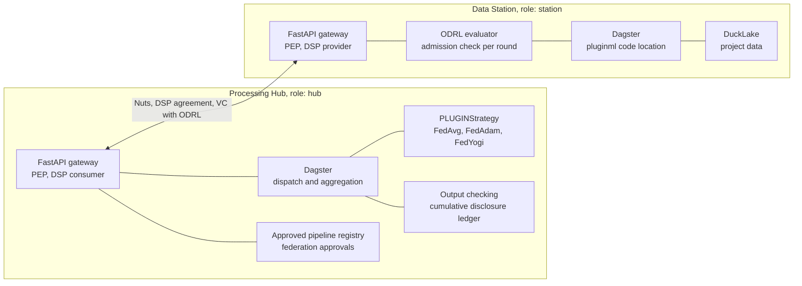

# Federated learning on the plugin stack

This document answers two questions:

1. How do we integrate federated learning into the plugin stack?
2. Where do we go from the current pluginml implementation to get there?

- the scope is federated learning: iterative model training with aggregation across rounds. Federated querying and analytics belong to pluginanalytics and are out of scope, though several mechanisms here (admission, output checking, failure semantics) have to serve both.
- it compares four routes against the ADRs and the phase model in [202609091552](202609091552_pluginlake-feature-status-and-phases.md).
- it is written against the platform we are building. Capabilities that are designed but unbuilt count as planned. Capabilities that are neither built nor designed are flagged as gaps.
- sources are pluginml on branch `aioc-day-v2` in `pluginml-dhd-mirror`, the ADRs, and the Flower + Dagster proposal in [20260911_gemini_flower_daster.md](20260911_gemini_flower_daster.md).

## Answer

**How to integrate.** As an application on the plugin stack, with training as a registered operation behind the gateway (route C).

- A pluginlake deployment with Dagster is on the station anyway. The choice is whether federated training runs next to it as a second runtime or inside it, and everything else follows from that.
- Both vantage6 and Flower bring their own control plane. A station then has two answers to "who may do what", and its own policy evaluator has no say over a training round. That is the main objection to either.
- Aggregation can run on any host that receives the updates. We centralise it so the data flow stays auditable, which means a federation can host its own aggregation node.
- The platform gaps are real: admission, output checking and the cumulative disclosure ledger are unbuilt, and the ADR that should specify algorithm admission does not exist. ADR-008 defers it to ADR-009 and ADR-009 declines it.

**Where to go from pluginml.** Smaller than it looks, because the hard part is already portable.

- Flower is used only as an aggregation library. There is no SuperLink and no SuperNode, so Flower stays as it is.
- `run_v6` is already a strict star with central aggregation, which is the hub shape. The ML code, the models, transformers, strategies and pipeline abstractions do not change.
- The work is one runtime seam (`PipelineRuntime`, with `run_v6` and `run_hub` as implementations), plus hardening the pipeline spec so it can be approved and enforced.
- The spec hardening is the real work and is independent of this decision. Today the spec resolves arbitrary dotted paths, carries a pickle fallback and mixes in run state, so nothing can be hashed or approved meaningfully.
- Keep the notebook as the interface. The client shape is already right, only the client implementation changes.

## Current situation

pluginml is in production at DHD on vantage6, across four to five hospitals, with DHD as aggregator.

- Flower (`flwr`) is imported for aggregation strategies (`PLUGINStrategy` wraps FedAvg, FedAdam, FedYogi) and for result serialization. There is no SuperLink, no SuperNode, no `flwr run`, no `[tool.flwr]`. Flower's app model is unused.
- vantage6 is the actual runtime: task dispatch, result collection, node data injection and scratch space. Roughly 4.1k lines of pluginml touch it.
- `run_v6` is the production path. It is a strict star: `main_org: 2` is the DHD aggregator, `child_orgs` are the hospitals, and hospitals never talk to each other.
- `run_v6_flower` is an experimental path that starts a real Flower gRPC server and has children dial the parent over the vantage6 VPN. This is the only code path that needs station-to-station connectivity and it violates our own rule.
- Privacy control is one constant, `PRIVACY_THRESHOLD = 5`, applied at a single call site in the EDA frequency code. No differential privacy, no secure aggregation, no column allowlists, no output checking on the training path.

The consequence is that the common framing, "migrate pluginml to Flower", is backwards. Flower is the portable part. vantage6 is what is welded in.

### Runtime properties that affect the design

Three properties of the current runtime affect the route decision. All three are architectural.

**The node needs Docker daemon access.** A vantage6 node starts algorithm containers through the Docker API, so it needs the Docker socket. Access to the Docker daemon is effectively root on the host, which makes the node a privileged component sitting next to patient data. vantage6 is itself moving to Kubernetes to get away from this. For us it matters twice: it is a hard conversation with hospital IT, and it conflicts with constraint 4, since the station would run a privileged second runtime alongside Dagster. Route C does not remove the problem, because training code still has to be isolated somehow, but it moves the decision into our own container isolation work in phase 5 rather than inheriting it.

**Everything is JSON.** vantage6 requires JSON payloads, so a 27.6 MB model becomes a 156 MB envelope, 4.5s to write and 3.1s to read, every round in both directions. pluginml already softens this by encoding numeric arrays as base64 raw buffers instead of nested lists, which is roughly 28x faster at 4/3 size overhead, but the envelope itself stays JSON. We inherit this constraint from vantage6, and it is why the payload format question below exists at all.

**Failure handling sits in the application.** Result retrieval has no per-node re-fetch, so the retry unit is the whole round. On a 16-round run across four nodes, one failed fetch discards the completed rounds. pluginml compensates with `RESULT_FETCH_ATTEMPTS`, `RESULT_RESUBMIT_ATTEMPTS`, `_run_round_with_resubmit`, result-count checking, per-round re-materialisation and `preflight_nodes()`. That is platform work living in an ML library. Route C should move it to the runtime layer, so pluginml and pluginanalytics get the same failure semantics.

## Constraints

From the ADRs, the phase document and the deployment rule for this network.

1. **Central aggregation only.** Data stations may not connect to each other. Each federation designates one aggregation node and stations connect only to that node.
2. **The FastAPI gateway is the single entry point and the PEP** (ADR-005, ADR-009). A project adds registered operations and predefined queries, never new external endpoints.
3. **Node identity is Nuts** (ADR-006), user rights are a VC with ODRL permissions verified at the station (ADR-008). The station holds the final decision.
4. **Station and hub are the same deployment with different role config.** They are one product in two roles.
5. **Disclosure control still applies.** No records move, but aggregate statistics and model parameters do, and the hub has to track what a researcher obtained cumulatively.

### Why aggregation is centralised

Aggregation is a function over a set of updates. Any host that can receive those updates can compute it. Nothing in federated learning requires a particular machine.

Centralisation is our rule, for auditability. Hospitals may not obtain information from each other, and a mesh makes the data flow impossible to enumerate for a DPIA or a permit. Three consequences:

- **The aggregator is a role.** Constraint 4 already treats station and hub as one deployment with different config, and the same applies here. The aggregation node does not have to be the Processing Hub, and it does not have to be the same host for every federation.
- **A federation can host its own aggregator.** If a federation does not want DHD's hub holding its round-by-round updates, it can run the aggregation node itself on the same software. This costs nothing as long as no code assumes a single global hub. pluginml hardcodes `main_org: 2` today, which is the assumption to drop.
- **The aggregator may not also be a data station in the same federation.** Otherwise stations are connecting to a station. This needs an explicit check at federation configuration time.

Flower fits this. Its SuperLink is a coordination point, but the ServerApp that runs the Strategy is a separate process (`flower-superlink --isolation process`) and can sit elsewhere. Flower has no peer-to-peer aggregation in the 1.x line, so it assumes one logical aggregator, which matches our rule. Topology is not the argument against Flower.

### Disclosure control without raw data

pluginml emits four kinds of output that need checking.

| Output | Where | Risk |
|:---|:---|:---|
| Per-column value counts, tagged per node | `eda/frequency.py`, `extract_from_history_row` | Per-hospital frequency tables, the standard SDC object |
| `tp`, `fp`, `fn`, `support` per class | `evaluation/confusion.py` | A class with `support = 1` at a node is one patient |
| Vocabulary plus document frequencies | `model/vectorizers.py:221` | A vocabulary from clinical free text lists terms that occur in records. The rare terms are the disclosive ones. `min_df` bounds this, but the researcher chooses it, so it is no governance floor |
| Column names and dtypes per node | `eda/info.py` | Schema disclosure, low risk but real |

Against that there is one threshold check, and it has three problems:

1. **Primary suppression only.** Cells below five are suppressed without secondary suppression, so they are recoverable by differencing against row totals or the cross-node aggregate, both of which the researcher also receives.
2. **Wrong location.** The threshold sits inside the algorithm, so an algorithm that does not call it is not subject to it, and a federation cannot set its own value. ADR-009 requires the opposite: SDC and permits are applied per federation at the hub, never inside the project.
3. **No state.** It has no record of earlier releases, which is the whole cumulative problem.

Model parameters need a different control set. Cell suppression does nothing against a weight vector. The attacks are membership inference and gradient inversion, and the controls are differential privacy, secure aggregation and declared bounds on what a step emits.

Multi-round runs make accumulation worse. A tabular query is one release. A 16-round run across five hospitals is a stream of releases with per-node attribution, and the same researcher usually ran EDA on the same cohort first. Something has to hold the record of what that researcher already obtained, and here that is the hub.

## The routes

The starting point is that a pluginlake deployment with Dagster is going to be on the station anyway. That is the platform, independent of this decision. So the real question is not which framework to pick, but whether federated training runs **next to** that deployment or **inside** it.

- Next to it: vantage6 or a Flower SuperNode runs as a second runtime on the same machine and uses pluginlake as a data source. Two orchestrators, two control planes, two sets of credentials, two isolation stories, on a box that already has an orchestrator capable of running the work.
- Inside it: the training round is a Dagster run behind the same gateway as everything else, so federated learning becomes an instance of the architecture instead of an exception to it.

That is what separates the routes. The table below says which plane each one integrates, because "connect pluginml to pluginlake" can mean two quite different things.

| Route | Control plane | Data plane | Identity |
|:---|:---|:---|:---|
| A: vantage6 standalone | vantage6 | vantage6 node databases | vantage6 |
| A': vantage6 reading the lake | vantage6 | **DuckLake at the station** | vantage6 |
| B: Flower-native plus Dagster | **SuperLink (new)** | Dagster or DuckLake | Flower node keys |
| C: pluginml as a platform application | **Gateway and hub** | **DuckLake** | **Nuts, DSP, ODRL** |
| D: vantage6 plus Nuts | vantage6 | vantage6 node databases | **Nuts** |

A' and D are partial integrations of different planes. A' gives pluginml the lake as a data source and leaves orchestration and identity on vantage6. D fixes identity and leaves orchestration and data where they are. Both are the "next to" shape: cheap, useful, and they keep two runtimes on the station. Neither moves the control plane, so in neither does a station evaluate a policy for a training round.

Route C is the full port: pluginml becomes an application in the pluginhub and pluginanalytics family, running on pluginlake core with its own UI, API surface, Dagster assets and code locations.

### The second control plane

Both vantage6 and Flower bring their own control plane, and that is the main architectural objection to either. A control plane here means: who decides what runs where, under whose identity, with what authorization, and where the audit trail lands.

We are building that anyway for federated queries: the gateway as PEP, Nuts for node identity, DSP for the agreement between nodes, a VC with ODRL permissions for the user, and the station holding the final decision. Adding vantage6 or Flower means a station carries two of them.

| | Ours | vantage6 | Flower |
|:---|:---|:---|:---|
| Node identity | Nuts DID | vantage6 account and API key | Registered EC public key |
| User identity | OIDC plus VC with ODRL | vantage6 user in a collaboration | None |
| Agreement between nodes | DSP contract | Collaboration record on the server | None |
| Authorization granularity | Per operation, per dataset, per user | Per algorithm image, per node | Is this node registered |
| Where it is enforced | Station, final decision | Node config | SuperLink |
| Entry point | The gateway | Its own server and ports | Its own gRPC ports |
| Audit trail | Ours | Theirs | Minimal |
| Release cadence | Ours | Theirs | Theirs |

The practical consequences:

- **It bypasses the PEP.** ADR-005 and ADR-009 make the gateway the single entry point and the place policy is enforced. A vantage6 server or a SuperLink is a separate service on its own ports, so Nuts, DSP, ODRL and output checking all sit outside it. Keeping our security model means rebuilding those inside or in front of it.
- **There are two answers to "who may do what".** A station's ODRL evaluator has no say over a training round dispatched through the other plane. Constraint 3 gives the station the final decision, and a second control plane quietly removes that for exactly the workload where it matters most.
- **It duplicates work rather than saving it.** We still have to build our own control plane for queries. Keeping a second one means operating both, keeping credentials in sync at every station, and reconciling two audit trails.
- **We do not control its release cadence.** A second plane's upgrade path becomes our upgrade path across every hospital.

vantage6's plane is at least governed: it models organisations, collaborations and per-algorithm whitelisting, which is why route D (keep it, add Nuts) is a reasonable bridge. Flower's answers only "is this SuperNode registered", which is why adopting a SuperLink would replace a governed second plane with an ungoverned one.

### Scored against the constraints

| | A: vantage6 | B: Flower-native | C: plugin stack | D: hybrid |
|:---|:---|:---|:---|:---|
| Central aggregation only | Yes on `run_v6`, no on `run_v6_flower` | Yes, SuperNode dials out | Yes by construction | Yes |
| Single PEP (ADR-005, ADR-009) | No | No, and a worse second plane | Yes | No |
| Nuts node identity (ADR-006) | No | No | Yes | Yes |
| DSP agreement plus ODRL per user (ADR-008) | No | No | Yes | Partial |
| Station can refuse an individual round | Node policy only | No | Yes | Node policy plus VC |
| Home for output checking and SDC | None | None | Hub | None |
| One runtime per station (constraint 4) | No, v6 node plus lake | No, SuperNode plus Dagster | Yes, Dagster | No |
| Privileged component at the station | Yes, node needs the Docker socket | No | Isolation choice is ours, phase 5 | Yes, node needs the Docker socket |
| Efficient large model transfer | No, JSON | Yes, gRPC | Yes, once the binary channel exists | No, JSON |
| Secure aggregation available | No | Yes, SecAgg+ | Adoptable, Flower strategies are retained | No |
| Central infra to operate | v6 server, Postgres, RabbitMQ | SuperLink | Hub, which we build anyway | v6 stack plus Nuts |
| pluginml change | None | High, adopt ClientApp/ServerApp | Medium, one runtime seam | None |

### Why not bare Flower

The topology objection does not hold. SuperNodes are gRPC clients that dial out to the SuperLink on port 9092, never accept inbound, and never talk to each other. Flower also does TLS plus registered EC node keys. It satisfies constraint 1.

What remains, on top of the second control plane above:

1. **It breaks the role model.** A SuperNode is a second long-lived runtime per station with its own credentials and lifecycle, next to Dagster.
2. **The Gemini proposal does not cross organisational boundaries.** Its recommended variant launches clients with `subprocess.Popen(["flwr", "run", ".#client1"])` and suggests Dagster Pipes for remote invocation. Both are same-trust-domain mechanisms. It describes a single-operator or simulated federation, which is exactly the part that is hard for us.
3. **We gain little.** What we use from Flower already works without SuperLink. Its real advantages, binary gRPC transport and SecAgg, are both reachable inside route C.

So route B adds a control plane with less governance than the one we already have, and its upside is available without it.

### Route C

Per round the hub dispatches a training operation to each station, the station's PEP evaluates the permission and the approval for that specific pipeline, Dagster runs the fit against DuckLake, and the result goes back as a checked binary payload. The hub aggregates with the existing `PLUGINStrategy` and starts the next round.

What the architecture gains: one control plane, one PEP, one audit trail. The station evaluates a permission per round and can refuse, so constraint 3 covers training as well as queries. There is finally a place for output checking and the cumulative ledger. Algorithm admission becomes a policy expression instead of a tag on an image.

#### The client stays a notebook

pluginml's interface is the Python API, and it should stay that way. Data scientists compose `FederatedPipeline(steps=[...])` in a notebook or script and submit it, as `notebooks/` and `aioc_eval/scripts/run_experiment_queue.py` already do. A pipeline-builder UI would be a worse version of code.

The existing shape is already right: construct a client, hand it to the pipeline (`PluginVantage6Client("../config.yaml")`, then `pipeline.run_v6_parent_child(client, ...)`). Route C keeps that signature and swaps the client implementation. Two things change around it: the researcher's identity has to come from the platform's programmatic auth path rather than a local YAML with a plaintext password, and submission has to be asynchronous, because a run awaiting approval cannot block a notebook cell for two days.

#### Three modelling problems this route surfaces

1. **pluginml owns no datasets.** ADR-009's project unit is dataset-centric: a project owns a DuckLake catalog and an asset-URN namespace. pluginml reads other projects' asset URNs and produces model artifacts that are not tables. There is no slot in the manifest for that shape, and no rule for declaring a dependency on another project's assets across a federation where the two projects may hold different permits.
2. **The approval dashboard belongs to core.** ADR-009 puts SDC and permits at the hub, per federation, never inside the project, so the project stays reusable. Algorithm approval is the same kind of act. pluginml contributes the renderable spec, core contributes the dashboard, registry and enforcement. Building the approval UI inside pluginml would make governance non-reusable, and pluginanalytics needs the same approval surface for its predefined queries.
3. **A training round is not a query.** Predefined queries are single request/response. A run is stateful across rounds, with a model that has to survive between them and failure semantics that differ per round. Neither ADR-008 nor ADR-009 has a session concept.

## Pipeline admission

This is the mechanism behind the dashboard idea: let federations approve algorithms and pipelines, and enforce that.

**The unit of approval is the pipeline spec.** Image digest pinning is on the roadmap and is necessary, but it does not settle this on its own. One pluginml image runs any pipeline handed to it, so a digest establishes which code could run while saying nothing about what will run. The spec says which transformers in which order, which strategy, how many rounds, against which asset URNs.

**Approve a template, pin the instance.** Exact spec hashing alone would break the notebook loop, because every learning-rate change would need re-approval, and the predictable outcome is a blanket approval that authorises everything. Instead the federation approves a template: which components in which order, which asset URNs, declared bounds on the free parameters, and a declared statement of what leaves a node each round. That is what gets reviewed, signed and hashed. At submission the station validates the concrete spec against the template and its bounds, then pins that instance hash for the whole run, so round 7 cannot differ from round 1. Bounded templates map cleanly onto ODRL constraints, and a bounded description is more reviewable than one frozen parameter set.

**Two tiers.** Local and simulated runs against synthetic data need no approval. pluginml already has `MockAlgorithmClient` and synthetic data generators for this. Approval applies only at the boundary to real station data. Keeping that line sharp is what makes strict enforcement at the second tier survivable.

**Approval is per station.** The federation approval is the default, but constraint 3 gives the station the final say, so a station can hold its own opt-out. The hub collects approvals and does not grant them.

**Enforcement has to happen at the station.** The hub is the convenient place to check and the wrong place to rely on. The station recomputes the spec hash on arrival, verifies the approval covers this federation, this asset URN set and this researcher, and refuses otherwise.

### What blocks this today

| Hole | Where | Effect |
|:---|:---|:---|
| `base_strategy` resolved from a free dotted path | `step.py:851`, `serde.py:228-229` | `importlib.import_module` plus `getattr` on a string from the payload. Any importable object can be named. Transformers already do this correctly with a registry check in `model/base.py:170-174` |
| Pickle fallback on the spec path | `step.py:839-845`, `:852-853` | Commented in the code as "the pickle path". A fallback that fires when the safe path fails is a bypass by construction |
| `pickle.loads` on incoming results | `flower/utils.py:324`, `serde.py:259-260` | The aggregator unpickles payloads arriving from stations. Under route C the aggregator is the hub, so any participating station can execute code on it |
| Run state inside the spec | `_has_started`, `_has_finished`, `_task_id` in `_attributes` | Nothing hashes stably, so there is nothing to pin |
| No canonical serialization | `serde.py` | No deterministic key order or encoding, so the same pipeline can produce different hashes |

An approval dashboard on top of this would approve nothing. These have to be closed first, and they have to be closed regardless of the vantage6 decision, because the same holes exist today and nothing enforces against them.

### The missing ADR

ADR-008 defers "the pre-approved algorithm and container registry" to ADR-009. ADR-009 explicitly declines it and says it belongs in a dedicated ADR in the 006/008 family. That ADR does not exist. The vocabulary is partly there, since the federation contract already enumerates which datasets and which operations including approved algorithms it grants, but the mechanism is unspecified. Writing this is the first action.

## Payload formats

The JSON-only envelope is something we inherit from vantage6. In pluginlake a result should be able to be any declared format.

FastAPI handles this fine. It streams arbitrary binary over `Response`, `StreamingResponse` or chunked upload, and content type is a header. The constraints are elsewhere:

- **The deserialization hole has to close at the same time.** Loosening the format while `pickle.loads` remains on the aggregator turns a fallback into an invitation. Allowlist the formats (Arrow IPC, Parquet, npz, safetensors) and refuse anything else.
- **Output checking needs to understand the format.** A checker that can read a DataFrame cannot read a torch checkpoint. Non-tabular results need their own checks, or they have to be declared as opaque and handled by policy instead.
- **Non-tabular storage has no contract yet.** This is already a known gap in the phase document, and model artifacts are the first concrete case.

The gain is real. Numeric arrays are already base64 raw buffers, which is about 28x faster than nested JSON lists with 4/3 size overhead. Raw binary removes the remaining overhead on the 156 MB envelope.

## What is missing

Grouped by where the work sits. Phase numbers follow the phase document.

### Processing Hub

| Feature | Status | Complexity | Phase |
|:---|:---|:---|:---|
| Hub runtime as a federated node: dispatch, aggregation, integrity checks | Partial, only a status overview and simple aggregation exist as prototype | High | 2/3 |
| Task dispatch to multiple stations with result collection | Not started, the pattern is described | High | 3 |
| Multi-round session object: model state survives between rounds, failure semantics per round | Not started and not designed. **Neither ADR-008 nor ADR-009 has a session concept** | High | 3/5 |
| Binary result channel with format allowlist | Not started, blocked on the non-tabular storage contract | High | 3/5 |
| Aggregation job wrapping the existing `PLUGINStrategy` | Not started, the pluginml side already works | Medium | 3/5 |
| Approved pipeline registry and approval workflow | Not started and **not specified anywhere**, see the missing ADR | High | 3 |
| Approval dashboard for federations | Not started. This is core functionality and belongs at the hub | Medium | 3 |
| Output checking on results | Not started, designed for tabular output only | High | 3/4 |
| Cumulative disclosure ledger per researcher across federations | Not started. The phase document already calls this **the real work** | High | 3 |
| OIDC provider plus programmatic access for researchers | Not started, product choice still open | High | 2/3 |

### Data Station

| Feature | Status | Complexity | Phase |
|:---|:---|:---|:---|
| Gateway that actually enforces policy | Partial, routes work but **the gateway enforces nothing and auth dependencies are always-pass** | High | 1 |
| Nuts node with own DID | Not started | High | 2 |
| ODRL evaluator with final local decision | Not started, approach designed, rules missing | High | 3 |
| Registered operations: training round and inference as grantable operations | Not started, the ADR-009 concept exists but has no ML instance | High | 3 |
| Admission check per round against the approved template | Not started, depends on the missing ADR | High | 3 |
| Asset registry resolving an asset URN to a local table | Partial, DuckLake reads work, the URN contract is in review in [#144](https://github.com/plugin-healthcare/pluginlake/pull/144) | Medium | 1/3 |
| Per-run scratch space for a training job | Not started | Low | 3 |
| Container runtime isolation for training code | Researched, isolation level not chosen | High | 5 |

### pluginml

Nothing in the ML code changes. Models, transformers, strategies, preprocessing, evaluation and the pipeline abstractions are untouched in all three groups below.

**Runtime decoupling.** Mechanical, low risk, worth doing under any route.

| Gap | Change | Size |
|:---|:---|:---|
| No runtime abstraction | Extract a `PipelineRuntime` protocol for dispatch, result collection, data injection and scratch path. `run_v6` becomes one implementation | Medium |
| No hub runtime | `run_hub` as the second implementation, talking to the gateway | Medium |
| `@data()` DataFrame injection by vantage6 database label | Resolve a registered asset URN against DuckLake, convert to pandas at the station boundary | Small |
| `TEMPORARY_FOLDER` scratch detected by `is_vantage6()` (`pipeline/utils.py:11-16`) | Runtime-provided scratch path | Small |
| `run_v6_flower` plus VPN parent-address discovery | Delete. It is the only path needing peer connectivity and it contradicts constraint 1 | Small |
| Retry, resubmit and per-round re-materialisation inside `FederatedStep` | Move to the runtime layer as a platform contract, do not reimplement per application | Medium |
| Aggregator hardcoded as `main_org: 2` | Federation configuration, with a check that the aggregator is not also a station | Small |

**Admission and enforcement.** These block the approval dashboard and are security-relevant.

| Gap | Change | Size |
|:---|:---|:---|
| Spec mixes specification with run state | Separate the two so the spec hashes stably | Small |
| No canonical serialization | Deterministic key order and encoding, one stable hash per spec | Small |
| `base_strategy` resolved by free dotted path | Registry lookup, same pattern as `BaseModel._registry` | Small |
| Pickle fallback on the spec path | Remove, no fallback | Small |
| `pickle.loads` on incoming results | Remove pickle from the wire in both directions | Medium |
| No declared component registry | Enumerable set of approved transformers, strategies, dataloaders and preprocessors a station will instantiate | Medium |
| No declared output contract per step | Declare what leaves a node per round, so a reviewer can reason about disclosure and the hub can check it | Medium |
| No parameter bounds in the spec | Declared bounds so a template can be approved once and instances validated against it | Medium |
| No resource declaration | Rounds, timeout and memory bounds, enforceable at the station | Small |
| `_git_commit_hash` as the version signal | A real release version, station refuses a mismatch | Small |

**Platform conventions.** Required to become an application in the pluginhub and pluginanalytics family.

| Gap | Change | Size |
|:---|:---|:---|
| No `ProjectManifest` or `pluginlake.projects` entry point | Declare id, config prefix, code locations, registered operations and asset-URN dependencies, passing `pluginlake verify` | Medium |
| Registered operations not declared | Training round and inference as machine-readable operations a federation can grant | Medium |
| Client library is vantage6-shaped | **Do not write a new client.** Keep the `client` plus `pipeline.run_*` signature, add a hub client behind the same runtime seam. This falls out of the runtime work above | Small |
| Submission is synchronous (`wait_for_results`) | Add a pending-approval state so a run can be submitted and resumed without blocking a notebook | Medium |
| `config.yaml` holds `username`, `password`, `2fa_code`, `privkey_PEM` in plaintext (`vantage.py:30-41`) | Platform programmatic auth carrying the researcher identity the ODRL permit binds to | Small |
| Renderable pipeline spec | Canonical human-readable description the core approval dashboard displays | Medium |
| `aioc_eval` Streamlit dashboard is hand-coded | Low priority. It does project-specific run evaluation and can stay as it is. It does not block the port | Low |
| `requires-python >=3.10`, image `python:3.10-slim`, pluginlake targets `>=3.13` | Align, or accept a separate interpreter for the pluginml code location. Torch and transformers pins make this non-trivial | Medium |
| Config is module-level mutable globals assigned at runtime | Pydantic Settings with the project env prefix | Small |
| Entry point is `wrap_algorithm()` in the Dockerfile CMD with vantage6 pins | Replaced by the station's registered operation invocation | Medium |
| Model artifacts in Azure Blob (`pluginml/storage/`) | Decide the artifact home, see open decision 5 | Medium |
| pandas only, no Polars or DuckDB | Keep pandas internally, convert at the station boundary. Not worth rewriting | None |
| Integration testing is in-process `MockAlgorithmClient` | An e2e harness against a real hub and two stations. There is no docker compose federation today | Medium |

The runtime decoupling is routine and the platform conventions are negotiable. **The admission group is the real work**, and it has to happen whether or not vantage6 stays.

## The path from here

Two tracks, because they are done by different people and only meet at step 5.

**Platform track.** Shortest path to one federated training run, everything else deferred.

1. Station authentication and the gateway as a real PEP. Nothing below is meaningful without it, and it is already gap 2 in the phase document.
2. Nuts identity on hub and station.
3. Decide who initiates (decision 1). It determines the shape of dispatch, so it cannot be deferred past this point.
4. Registered operation invocation plus the asset registry at the station, replacing `@data()`.
5. Hub dispatch, collection and the aggregation job around `PLUGINStrategy`.
6. Binary result channel and the multi-round session object. These are the two genuinely new pieces of architecture and they are on the critical path.

**pluginml track.** Can start now, independent of the platform track and useful regardless of the outcome.

1. Harden the spec: canonical serialization, registry-only component resolution, no pickle, run state out of the spec. This is the work that makes approval possible at all, and the same holes exist under vantage6 today.
2. Extract `PipelineRuntime` and make `run_v6` an implementation of it. Move retry, resubmit and re-materialisation out of `FederatedStep` into the runtime layer.
3. Delete `run_v6_flower`.
4. Replace the hardcoded `main_org: 2` with federation configuration.
5. Add `run_hub` as the second runtime implementation, plus a hub client behind the existing client signature. This is where the two tracks meet.

Steps 1 to 4 of the pluginml track are worth doing on their own merits. They shorten the migration from a rewrite to one new implementation, and if the decision changes they cost nothing.

Output checking, the disclosure ledger, parameter-level privacy controls and container isolation are required before real patient data. A first run on synthetic data does not need them. That line separates a demonstrable architecture from a deployable one.

## Open decisions

1. **Who initiates, hub or station?** The most under-examined decision here. vantage6 nodes poll outward and Flower SuperNodes dial outward, but **ADR-008 has the hub calling the station**, which requires hospitals to expose an inbound endpoint. That is a much harder sell to hospital IT, and ADR-008 does not discuss it. If inbound is unacceptable the station needs an outbound long-poll or queue-pull, which changes the DSP binding. This affects every federated operation, including the queries pluginanalytics runs.
2. **Does the aggregator see individual contributions?** In route C the hub aggregates in the clear, as vantage6 does today. Defensible, but it has to be a stated and accepted risk in the threat model, and it is the argument for secure aggregation later.
3. **Who approves, and is federation approval enough?** Per-station approval is proposed because constraint 3 gives the station the final say. Needs confirming as policy. Related: may a station approve a pipeline the federation rejected, and does a run proceed with a partial set of approving stations? The second has a statistical consequence, since dropping a station changes what the model represents.
4. **Does the component registry become a governance surface?** Once stations only instantiate registered components, adding a transformer to pluginml becomes a network-wide change, since every station must run a version containing it. That constrains release cadence and makes version compatibility load-bearing.
5. **Where do model artifacts live?** pluginml uses Azure Blob today. Hub artifact, DuckLake non-tabular asset, or external? This is the first concrete non-tabular asset the platform has to hold, so it is a useful forcing case for that contract.
6. **How is an application that owns no data modelled?** ADR-009's project unit is dataset-centric and has no slot for an application that owns no datasets, reads other projects' asset URNs and emits non-tabular artifacts. pluginanalytics has the first half of this problem and pluginml has both halves. This needs resolving before pluginml can contribute a manifest at all.

## Recommendation

1. **Adopt route C as the target.** It is the only route where federated ML is governed by the same mechanisms as everything else.
2. **Keep Flower as a library, drop Flower-native.** SecAgg and binary transport, the two things a SuperLink would buy, are both reachable inside route C.
3. **Use route D as the bridge**, labelled explicitly as a transition state so the second control plane does not quietly become permanent.
4. **Introduce the runtime seam in pluginml now.** It is worth doing on its own merits, given how much vantage6-specific retry logic sits inside `FederatedStep`. It also turns the eventual migration into a second implementation of an existing interface.
5. **Delete `run_v6_flower`.** Leaving it in the codebase invites someone to deploy it.
6. **Write the missing admission ADR first.** Everything else in the governance story depends on it.
7. **Build the admission model before the dashboard.** Approving a spec that names arbitrary importable objects and carries a pickle fallback approves nothing.
8. **Approve templates with declared parameter bounds** and pin the instance hash per run. Keep local and simulated runs outside the approval path.
9. **Keep the notebook as the interface.** Invest UI effort in federation-side approval and revocation in core and hub.
10. **Treat the aggregator as a per-federation role**, so a federation can host its own aggregation node.
11. **Extend ADR-008 and ADR-009** for the binary result channel, the multi-round session, failure semantics as a platform contract and output checking on non-tabular results.
12. **Drop the JSON-only envelope and remove pickle from the wire at the same time.** They go together.

## Sources

- pluginml, branch `aioc-day-v2` in `pluginml-dhd-mirror` (HEAD `ec069ef`). `docs/handover/flwr_architecture.md` and `docs/handover/vantage6_architecture.md` are the best single artefacts.
- ADR-005 (API gateway), ADR-006 (Nuts), ADR-008 (DSP, ODRL, authz), ADR-009 (core and project split, on `origin/core-project-split-adr`, [#144](https://github.com/plugin-healthcare/pluginlake/pull/144)).
- [202609091552](202609091552_pluginlake-feature-status-and-phases.md), phase model and gap list.
- `docs/background/federated-infrastructure.md`, earlier analysis recommending the vantage6 plus Nuts hybrid short-term.
- [20260911_gemini_flower_daster.md](20260911_gemini_flower_daster.md), the Flower plus Dagster proposal.
- Flower 1.22 documentation for the deployment model and `flower-superlink --isolation`.
- vantage6 documentation on the node's Docker requirement and the move to Kubernetes.
