# DSP Authorization Architecture

Design specification for how the Eclipse Dataspace Protocol, Nuts identity, and ODRL authorization map onto pluginlake's existing components (FastAPI, Dagster, DuckLake).

This document is the implementation companion to [ADR-008](../decisions/adr-008-dataspace-protocol-authz-authc-rbac.md) (the decision record).

---

## How DSP/Nuts/ODRL map to pluginlake

The table below shows which external standard concept maps to which pluginlake component, and what role each plays:

| Standard concept | pluginlake component | Role |
|---|---|---|
| DSP Catalog Protocol | FastAPI `/dsp/catalog` + station asset registry (YAML) | Exposes which datasets a station offers, with what terms |
| DSP Contract Negotiation | FastAPI routes + pluginlake database (`dsp.negotiation`) | Bilateral agreement between hub and station on what's allowed |
| DSP Transfer Process | FastAPI routes + Dagster materialization + pluginlake database (`dsp.transfer_process`) | Triggers compute, tracks execution, issues scoped data access |
| Nuts DID + NutsOrganizationCredential | Nuts Node sidecar + FastAPI middleware | Proves which organization is making a request (boundary 2) |
| Nuts DPoP access token | `Authorization` header on every inter-node HTTP call | Per-request proof of org identity, validated by local Nuts Node |
| PluginlakeAccessCredential (VC) | Hub issues → station verifies (PyJWT + cryptography) | Per-request proof of user permissions (boundary 3) |
| ODRL policy (in agreement) | JSON in `dsp.negotiation.policy` column | Outer bounds: what the agreement allows |
| ODRL permissions (in VC) | Embedded in PluginlakeAccessCredential | Inner bounds: what this specific user is allowed |
| ODRL profile evaluation | `src/pluginlake/authz/` Python module (~300 lines) | Intersects agreement + VC + station-local restrictions |
| Station asset registry | YAML config → maps ODRL URNs to DuckLake tables/Dagster assets | Station-local truth about what data exists and what's exposable |
| Station operation registry | YAML config → maps ODRL actions to SQL templates/Dagster jobs | Station-local truth about what computations are allowed |
| Privacy validation | Polars-based post-execution checks | k-anonymity, cardinality limits, applied after query execution |

---

## DSP Catalog ↔ Asset Registry + FastAPI

**DSP says:** A provider exposes a DCAT catalog with datasets and their ODRL offers.

**pluginlake does:** The station maintains a YAML asset registry that defines which DuckLake tables/Dagster assets are externally visible. The `/dsp/catalog` endpoint generates the DCAT response from this registry at request time.

```
DSP Catalog Request → FastAPI → Asset Registry (YAML) → DCAT + ODRL response
```

The asset registry is the single source of truth for what a station exposes. It maps abstract ODRL target URNs to concrete local resources:

```yaml
# station_assets.yaml (excerpt)
assets:
  "urn:pluginlake:dataset:omop_condition":
    dagster_asset_key: ["omop", "condition_occurrence"]
    ducklake_schema: "omop"
    ducklake_table: "condition_occurrence"
    available_columns: [condition_concept_id, condition_start_date, ...]
    sensitive_columns: [person_id]  # never exposed externally
    external: true   # appears in DSP catalog

  "urn:pluginlake:dataset:omop_person":
    dagster_asset_key: ["omop", "person"]
    external: false  # internal only, hidden from DSP catalog
```

Only assets with `external: true` appear in the catalog response:

```python
@router.get("/dsp/catalog")
async def get_catalog(registry: AssetRegistry = Depends(get_asset_registry)):
    datasets = [
        {"@type": "dcat:Dataset", "@id": urn, "odrl:hasPolicy": build_offer(asset)}
        for urn, asset in registry.items() if asset.external
    ]
    return {"@type": "dcat:Catalog", "dcat:dataset": datasets}
```

---

## DSP Negotiation ↔ Agreement Lifecycle + pluginlake database

**DSP says:** Consumer and provider negotiate a contract. The provider can accept, reject, or counter-offer. Once FINALIZED, the agreement governs all subsequent data access.

**pluginlake does:** The hub (consumer) initiates a negotiation. The station (provider) may require human approval from a station admin. The agreed ODRL policy is stored as JSON alongside the negotiation state. All subsequent requests are checked against this agreement.

```
Hub operator → Hub FastAPI → DSP ContractRequestMessage → Station FastAPI
    → Station admin approves/tightens → DSP AgreementMessage → database
```

**Storage requirements:**
- Transactional state machine (no partial state transitions — a negotiation is either REQUESTED or OFFERED, never both)
- JSON storage for ODRL policies (variable structure, needs querying)
- Foreign key relationship between negotiation and transfer records
- Concurrent access from FastAPI workers + Dagster sensors

**Current implementation:** `dsp` schema in the existing PostgreSQL instance (same container as Dagster and DuckLake metadata). This may move to DuckLake-managed tables or a dedicated DuckDB instance if the project moves away from Postgres.

```sql
-- Current: Postgres dsp schema
CREATE TABLE dsp.negotiation (
    id           UUID PRIMARY KEY,
    consumer_id  TEXT NOT NULL,    -- Nuts DID of consumer org
    dataset_id   TEXT,             -- primary asset URN
    state        TEXT NOT NULL,
    policy       JSONB,            -- ODRL policy agreed upon
    ...
);
```

**State machine** (provider-side, as defined by DSP 2025-1):

```
REQUESTED → OFFERED → AGREED → VERIFIED → FINALIZED → [active]
    └→ TERMINATED (from any state)
```

**What the agreement sets vs what happens per-request:**

| Resolved during negotiation (once) | Resolved per-request |
|---|---|
| Which datasets | Which specific user (in VC) |
| Which operations allowed | Which columns returned (station applies) |
| Purpose of use | Row filters (station applies) |
| Agreement validity period | Privacy thresholds (station checks post-execution) |

---

## DSP Transfer ↔ Dagster Materialization

**DSP says:** After an agreement exists, the consumer requests a data transfer. The provider executes it and provides access to results.

**pluginlake does:** A transfer request triggers a Dagster asset materialization. A Dagster sensor monitors run completion and transitions the DSP state accordingly. On completion, a scoped token is issued for data retrieval from DuckLake.

```
Transfer request → validate agreement → trigger Dagster run
    → sensor detects completion → issue scoped token → callback to consumer
    → consumer GETs /dsp/data/{transfer_id} with token → DuckLake query result
```

**DSP state ↔ Dagster mapping:**

| DSP state | What happens in pluginlake |
|---|---|
| REQUESTED | Agreement validated, transfer record created in database |
| STARTED | `POST /api/assets/{key}/materialize` triggered, `dagster_run_id` stored |
| COMPLETED | Sensor detects run SUCCESS, scoped JWT issued, callback sent to hub |
| TERMINATED | Run FAILURE/CANCELED or consumer cancels; token revoked |

**Key constraint:** DSP requires the provider to push state-change callbacks to the consumer even for pull transfers. This is why `consumer_callback` is stored per transfer.

**Data access after completion:** The consumer receives a `DataAddress` containing a time-limited signed token and endpoint `GET /dsp/data/{transfer_id}`. This is a short-lived bearer token (not a VC) scoped to one transfer.

---

## Nuts VP ↔ FastAPI Middleware (boundary 2)

**Nuts says:** Organizations prove identity via DPoP-bound access tokens. The calling node obtains a token from its local Nuts Node (which involves presenting VPs during the OAuth2 exchange). The token is sent per-request.

**pluginlake does:** FastAPI middleware extracts the `Authorization` header, validates the DPoP proof against the local Nuts Node (localhost call, no network round-trip), and populates the request context with the authenticated organizational identity.

```
Hub request → Authorization: DPoP <token>
    → FastAPI middleware → POST /internal/auth/v2/dpop/validate (local Nuts Node)
    → request context: {organization_did, organization_name}
    → route handler proceeds
```

This proves *which organization* is calling. It does not say anything about *which user* or *what they're allowed to do* — that's boundary 3 (the PluginlakeAccessCredential).

---

## PluginlakeAccessCredential ↔ Per-user Authorization (boundary 3)

**ODRL says:** Permissions can be expressed as policies with actions, targets, and constraints.

**pluginlake does:** The hub issues a Verifiable Credential to each researcher containing their permitted datasets, operations, and constraints (expressed as pluginlake's ODRL profile). The station verifies the VC signature, checks it references an active agreement, and extracts the claims for enforcement.

```
Researcher logs in at hub (OIDC) → hub issues PluginlakeAccessCredential
    → researcher's request to station carries: Nuts DPoP token + VC (as VP)
    → station verifies: signature, issuer trust, agreement reference, expiry
    → station extracts: permitted datasets, operations, columns, constraints
```

The VC is issued by the hub's DID (signing key in the hub's DID document). The station trusts hub signing keys learned through the Nuts network.

---

## ODRL Profile ↔ Enforcement Layer

**The enforcement problem:** Three independent sources of constraints must be merged into a single executable query:

1. **Agreement** (from DSP negotiation) — outer bounds
2. **VC** (from presented credential) — user-specific bounds
3. **Station-local config** (from YAML) — station sovereignty

**pluginlake's rule: most restrictive wins.** The enforcement layer intersects all three:

```
Agreement:   datasets=[omop_condition], ops=[aggregate, count], purpose=research
VC claims:   datasets=[omop_condition], ops=[aggregate], columns=[concept_id, start_date]
Station:     sensitive_columns=[person_id], min_k=5, max_rows=50000

→ Enforced: table=omop.condition_occurrence, columns=[concept_id, start_date],
            operation=aggregate, k-anonymity=5, person_id=DENIED
```

**The enforcement function** translates this into an executable query or Dagster job:

```python
def enforce_request(vc_claims, agreement, request, asset_registry, operation_registry, station_policy):
    """Translate a verified request into a constrained executable query."""
    # 1. Resolve ODRL target URN → local DuckLake table
    # 2. Intersect permitted operations (agreement ∩ VC ∩ station)
    # 3. Intersect permitted columns (available - sensitive ∩ VC-permitted)
    # 4. Build constrained SQL or trigger Dagster job
    # 5. Attach privacy checks (k-anonymity, max cardinality)
    ...
```

**Operation registry** maps ODRL actions to concrete execution:

```yaml
# station_operations.yaml (excerpt)
operations:
  "pluginlake:aggregate":
    type: sql_template
    sql: "SELECT {columns}, COUNT(*) as n FROM {table} {where} GROUP BY {columns}"
    min_group_size: 5

  "pluginlake:federated_learning":
    type: dagster_job
    job_name: "fl_training_round"
    allowed_parameters: [model_type, epochs, batch_size]
```

---

## Governance models

Three models control *who approves agreements*. Runtime enforcement is identical regardless of model.

| Model | Who approves | Station autonomy |
|---|---|---|
| **Data holder governed** (default) | Station admin reviews each agreement | Full |
| **Collaboration governed** | Coordinator pre-configures for all stations | Delegated (auto-accept) |
| **Hybrid** | Collaboration sets baseline, station can only tighten | Preserved (can restrict, not relax) |

**Station-local overrides are always authoritative.** A collaboration coordinator cannot override a station's local restrictions.

---

## Role-based access control

### Processing hub roles

| Role | Can do | Cannot do |
|---|---|---|
| **Network admin** | Initiate DSP negotiations, configure credential issuance, manage operators | Access research data, submit queries |
| **Hub operator** | Add/remove researchers, map users to agreements, monitor | Initiate or approve agreements |
| **Researcher** | Browse permitted catalog, submit queries within scope, view own results | Modify permissions, initiate agreements |

### Data station roles

| Role | Can do | Cannot do |
|---|---|---|
| **Station admin** | Accept/reject agreements, configure access policy, manage station | Override collaboration constraints to be more permissive |
| **Station operator** | View agreements (read-only), monitor transfers and logs | Approve/reject agreements, modify policy |

Example:

```python
@router.post("/dsp/negotiations")
async def initiate_negotiation(request: ContractRequestMessage, user = Depends(require_role("network_admin"))):
    ...

@router.post("/dsp/negotiations/{id}/events")
async def negotiation_event(id: UUID, event: NegotiationEvent, user = Depends(require_role("station_admin"))):
    ...
```

For the full RBAC entity model, see [Part 2 below](#role-based-access-control-for-hub-and-station-operators).

---

## DSP protocol constraints

Constraints imposed by DSP 2025-1 that affect pluginlake's implementation:

| DSP constraint | pluginlake implication |
|---|---|
| JSON-LD mandatory | Pydantic models handle compacted form; `pyld` added if external connectors send expanded |
| Provider must push state callbacks | `consumer_callback` stored per transfer; outbound HTTP even for pull transfers |
| No negotiation timeout defined | pluginlake defines its own timeout policy (configurable) |
| Messages use `@context`, `@type`, `@id` | Pydantic `Field(alias="@context")` pattern |

---

## DSP routes on FastAPI

```
# Internal routes (unchanged)
GET  /api/catalog/schemas          → DuckLake schema listing
GET  /api/catalog/tables           → DuckLake table listing
POST /api/assets/{key}/materialize → Dagster run trigger

# DSP routes (Eclipse Dataspace Protocol 2025-1 HTTPS bindings)
GET  /.well-known/dataspace                            → Self-description
GET  /dsp/catalog                                      → DCAT catalog (from asset registry)
POST /dsp/catalog/request                              → Filtered catalog query
POST /dsp/negotiations/request                         → Start negotiation
GET  /dsp/negotiations/{providerPid}                   → Get negotiation state
POST /dsp/negotiations/{providerPid}/events            → Accept/reject/counter
POST /dsp/negotiations/{providerPid}/agreement/verification  → Verify agreement
POST /dsp/negotiations/{providerPid}/termination       → Terminate
POST /dsp/transfers/request                            → Start transfer
GET  /dsp/transfers/{providerPid}                      → Get transfer state
POST /dsp/transfers/{providerPid}/start                → Signal started
POST /dsp/transfers/{providerPid}/completion           → Signal completed
POST /dsp/transfers/{providerPid}/termination          → Terminate

# Data access (post-transfer)
GET  /dsp/data/{transfer_id}       → Pull result data (scoped token required)
```

---

## Phased delivery

### Phase 1: DSP provider + Nuts identity

**Goal:** One station receives DSP requests from one hub, authenticated via Nuts. Contract negotiation works end-to-end.

**Delivers:**
- `src/pluginlake/dsp/`: DSP provider routes (catalog, negotiation, transfer)
- Nuts middleware for org identity verification
- Negotiation state machine (`dsp` schema)
- Transfer → Dagster materialization → scoped token
- Station asset registry (YAML)
- Integration test client (simulates hub)

**Does not include:** hub-side DSP client, per-user VCs, ODRL evaluation, multi-hub, RBAC dashboard.

### Phase 2: Per-user credentials + ODRL enforcement

**Goal:** Per-user authorization at the station.

**Delivers:**
- `src/pluginlake/authz/`: ODRL evaluator, VC verification, enforcement
- PluginlakeAccessCredential schema (ADR-009)
- Hub issues VCs, station verifies per-request
- Operation registry (YAML → SQL templates / Dagster jobs)
- Constraint enforcement (columns, rows, privacy)
- Multi-hub topology

### Phase 3: UI + governance + collaboration

**Goal:** Production-ready multi-org network.

**Delivers:**
- Hub UI (Streamlit): credential issuance, agreement monitoring
- Station UI (Streamlit): access control dashboard, approval workflow
- RBAC entity model
- Governance models (data holder, collaboration, hybrid)
- Audit trail + decision logging
- Credential revocation (StatusList2021)


---

# Part 2: Options analysis, UX workflows, and deep-dive reference

The following sections preserve the detailed options analysis, dashboard UX workflows, RBAC entity model, governance models, and international standards appendix from the original architecture evaluation.

---

## Options analysis: authentication and authorization architecture

> **Editorial note:** This section documents the five options evaluated during the architecture design process. The initial recommendation was Option A (Nuts + OPA). Through iterative design, the architecture evolved to a **VC-native ODRL approach** (a refined variant of Option D) that eliminates OPA entirely. The adopted architecture is described in the "Enforcement" section below. This analysis is preserved to document why each alternative was considered and rejected.

Five options were evaluated. All assume DSP for the protocol layer. They differ in how trust boundaries 2 and 3 are handled.

### Option A: Nuts + OPA with pluginlake user context token (initially recommended)

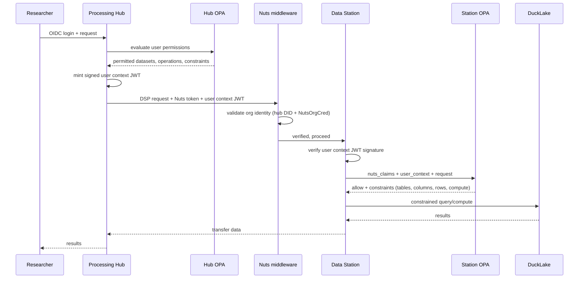

**How Nuts is used:** Strictly for inter-node organizational identity (trust boundary 2). Answers one question: "is this hub a known participant in the pluginlake network?" Once verified, Nuts is done. No fine-grained permissions in the Nuts token.

**How OPA is used:** For all fine-grained access control (trust boundary 3). The hub's OPA computes permitted datasets, operations, and constraints for the user, then mints a signed JWT. The station's OPA evaluates the JWT claims against the request and its own policy. OPA runs as a sidecar on both hub and station.

**The pluginlake user context token** is a JWT signed by the hub, containing:

```json
{
  "iss": "did:nuts:hubA",
  "aud": "did:nuts:stationX",
  "hub_id": "hub-A",
  "hub_did": "did:nuts:hubA",
  "user_id": "researcher-Y",
  "purpose": "urn:pluginlake:purpose:observational-research",
  "agreement_id": "abc123",
  "permitted_datasets": ["omop_condition", "omop_observation"],
  "permitted_operations": ["aggregate", "query"],
  "iat": 1234567890,
  "exp": 1234568190
}
```

**Security requirements for the user context JWT:**

- `aud` (audience) is **mandatory** -- prevents cross-station replay attacks. A JWT issued for Station X cannot be presented to Station Y.
- `iss` (issuer) must match the hub's DID as registered in the Nuts network.
- `exp` is set to cover the expected request duration (default: 5 minutes). The station validates the JWT **at request initiation only** -- once the Dagster run starts, the JWT is not re-checked during execution. The agreement validity (not JWT expiry) governs long-running jobs.
- The station must reject JWTs where `aud` does not match its own DID.

**Why Nuts and OPA do not overlap:**

| Question | Answered by | Not answered by |
|---|---|---|
| Is this node a network participant? | Nuts | OPA |
| Which organization operates this node? | Nuts | OPA |
| What datasets can this user access? | OPA | Nuts |
| What columns/rows are permitted? | OPA | Nuts |
| What compute operations are allowed? | OPA | Nuts |
| What is the purpose of this request? | OPA | Nuts |

**Benefits:**
- Clean separation: zero functional overlap between Nuts and OPA
- Per-user, per-dataset, per-operation audit trail at the station (satisfies EHDS and DPO requirements)
- Compute constraints (column filters, row filters, aggregation-only, privacy checks) are first-class
- Station has independent enforcement -- does not fully trust the hub
- Dynamic permissions without DSP contract renegotiation
- OPA is CNCF-graduated, production-grade, sub-millisecond evaluation
- Interoperable with Dutch healthcare ecosystem via Nuts

**Drawbacks:**
- Custom user context token format must be standardized (candidate for ADR-009)
- Hub signing key management is an operational concern
- OPA sidecar adds a deployment component per station and per hub
- JSON-LD credentials must be flattened before passing to OPA (no native JSON-LD in Rego)
- Not DSP-native -- the user context token is pluginlake-specific
- Three sidecars per station (Nuts node, OPA, Dagster code server) increases operational complexity

**Verdict:** Initially recommended. Provides the enforcement granularity required by EHDS and hospital DPOs. Through iterative design, this evolved into the adopted VC-native ODRL approach which achieves the same enforcement without the OPA sidecar dependency.

---

### Option B: OPA only, no Nuts (mTLS + internal PKI)

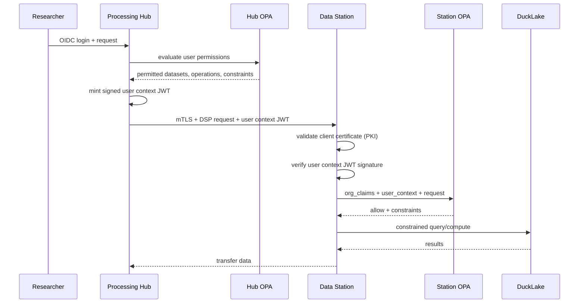

**How org identity works without Nuts:** mTLS with a shared PKI. Each pluginlake instance has a client certificate signed by a pluginlake CA (managed by DHD). The station validates the certificate chain to verify the hub is a known participant. Network membership is managed by certificate issuance/revocation.

**Benefits:**
- Simpler infrastructure: no Nuts node sidecar per station
- No dependency on Nuts network availability
- No Bolt definition or Nuts community governance required
- mTLS is well-understood, widely supported
- All fine-grained enforcement in OPA -- single policy system

**Drawbacks:**
- Not interoperable with the broader Dutch healthcare ecosystem (Nuts is the direction for NL health dataspaces)
- PKI certificate management is a significant operational burden (issuance, rotation, revocation, HSMs)
- Network membership is centralized in the CA -- DHD becomes a single point of authority
- No decentralized identity -- cannot interoperate with external dataspaces using VCs
- Does not align with EHDS direction toward decentralized trust frameworks
- No discovery mechanism -- stations must be configured with known hub certificates manually

**Verdict:** Technically simpler but strategically weak. Choosing this option means pluginlake cannot participate in the broader Dutch health dataspace ecosystem that is converging on Nuts. Only appropriate if pluginlake will always be a closed, DHD-managed network with no external interoperability requirement.

---

### Option C: Nuts only, no OPA

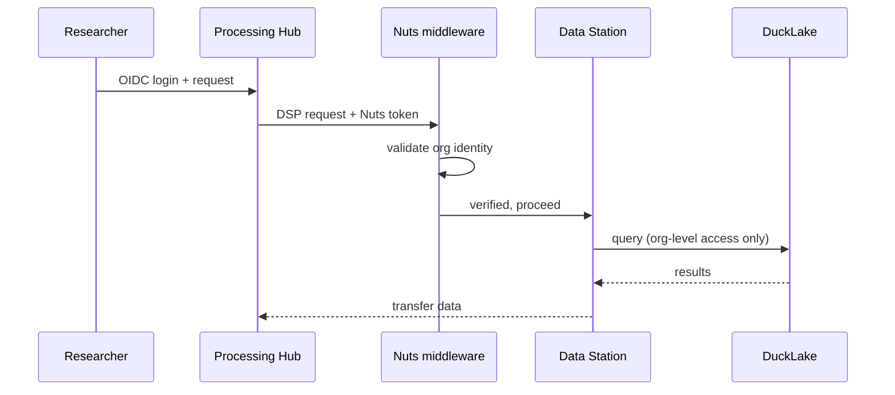

**Benefits:**
- Simplest architecture: one auth system
- Fully decentralized, no custom token format
- Interoperable with NL health ecosystem

**Drawbacks:**
- No per-user visibility at the station. DPO cannot audit which researcher accessed data.
- No per-dataset access control beyond Nuts scope
- No compute constraints -- Nuts cannot express "aggregate only, no extraction"
- Hub must be fully trusted to enforce all fine-grained access. Station has no independent enforcement.
- Does not satisfy EHDS Article 50+ requirements for auditing which data user accessed which data for which purpose.

**Verdict:** Insufficient for a research data platform where legal data sharing agreements are per researcher and per purpose.

---

### Option D: Nuts + ODRL policy evaluation (DSP-native)

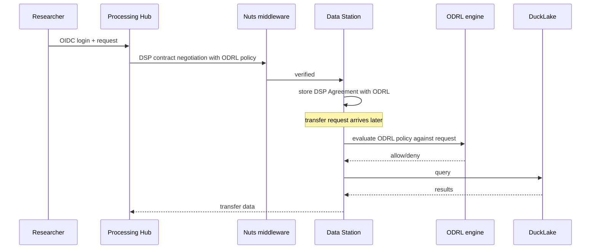

**Benefits:**
- Fully standards-compliant (DSP + ODRL)
- No custom token format
- Interoperable with any DSP connector supporting ODRL

**Drawbacks:**
- ODRL cannot natively express compute constraints (column allowlists, row filters, max cardinality, privacy checks). Custom ODRL profiles needed, reducing interoperability.
- No existing Python ODRL evaluation library for the full spec
- Every permission change requires renegotiating a DSP contract
- Contract explosion: new agreement per user × per dataset × per purpose
- ODRL deontic conflict resolution (prohibition overrides permission) must be built from scratch

**Verdict:** Elegant in theory but impractical for v1 as originally scoped. However, through iterative design, a constrained version of this approach (Level 2 ODRL profile with built-in evaluator, VC-based credentials instead of custom JWT) became the adopted architecture. See the "Enforcement" section for the final design.

---

### Option E: No Nuts, no OPA (API keys + application-level enforcement)

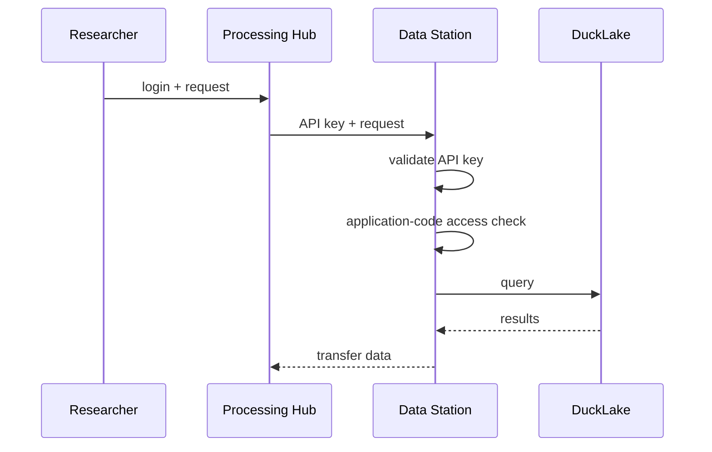

**Benefits:**
- Simplest possible implementation
- No external dependencies
- Fast to prototype

**Drawbacks:**
- No organizational identity verification
- No interoperability with any external dataspace
- No decentralized trust -- fully centralized API key management
- Security model equivalent to a shared password
- Does not satisfy any EHDS, Health-RI, or DSP requirement
- Not viable for a multi-organization network

**Verdict:** Only suitable for local development and testing. Not an option for production.

---

### Options comparison

| Criterion | A: Nuts+OPA | B: OPA only | C: Nuts only | D: Nuts+ODRL (adopted) | E: API keys |
|---|---|---|---|---|---|
| NL health ecosystem interop | ✓ | ✗ | ✓ | ✓ | ✗ |
| Per-user audit at station | ✓ | ✓ | ✗ | Partial | ✗ |
| Compute constraints | ✓ | ✓ | ✗ | ✗ | ✗ |
| EHDS compliance | ✓ | Partial | ✗ | ✓ | ✗ |
| DSP standards compliance | ✓ | ✓ | ✓ | ✓ | ✗ |
| Decentralized identity | ✓ | ✗ | ✓ | ✓ | ✗ |
| Operational complexity | High | Medium | Low | High | Low |
| Custom token format needed | Yes | Yes | No | No | No |
| External dataspace interop | ✓ | ✗ | ✓ | ✓ | ✗ |

---

## Contract negotiation scenarios

Once a DSP agreement is FINALIZED, it covers all subsequent requests within its scope. Individual queries and compute requests do NOT require re-negotiation — they reference the existing agreement and present a VC proving authorization within that agreement's terms.

### Scenario 1: Hub-initiated, bilateral approval (default)

The processing hub initiates the contract and sends it to the data station. The station must explicitly approve before the agreement is active. This is the standard DSP flow.

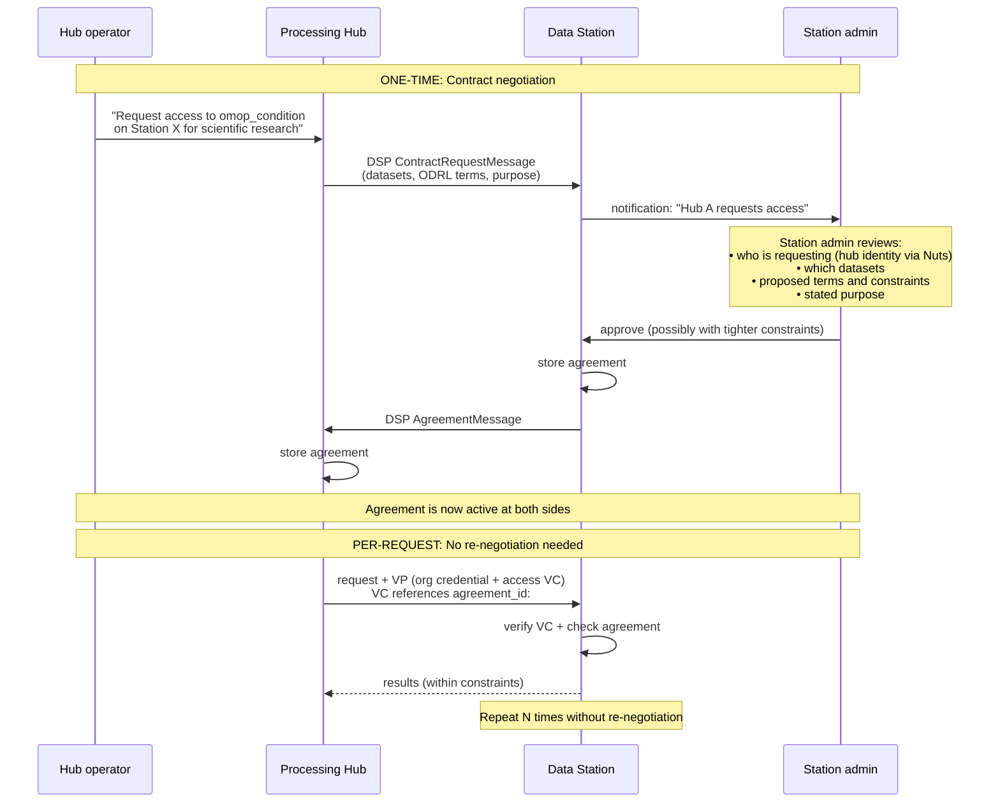

**Key properties:**
- Hub cannot access anything until station explicitly approves
- Station stores the agreement — knows exactly what it agreed to
- Every subsequent request references this agreement
- Station can terminate agreement at any time (immediate effect)
- Hub can request access to additional datasets → new negotiation required

### Scenario 2: Hub-initiated with station counter-offer

The station may not accept the hub's proposed terms as-is. It can counter-offer with tighter constraints. The hub must then accept the modified terms.

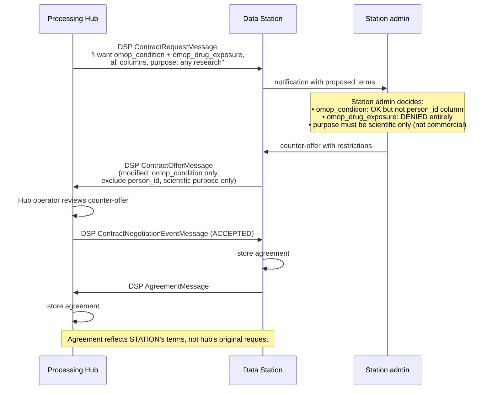

**Key properties:**
- Station has full power to modify terms before agreeing
- Hub sees exactly what was approved (no surprises at request time)
- The finalized agreement is the station's version, not the hub's proposal
- Constraints in the agreement are the MAXIMUM the hub can request — station can still apply additional restrictions at query time

### What the agreement covers vs what happens per-request

| Concern | Resolved during negotiation (one-time) | Resolved per-request (every query) |
|---|---|---|
| Which datasets | ✓ (in agreement) | |
| Which operations allowed | ✓ (in agreement) | |
| Purpose of use | ✓ (in agreement) | |
| Agreement valid until | ✓ (in agreement) | |
| Which specific user | | ✓ (in VC presented with request) |
| Which columns returned | | ✓ (station applies at query time) |
| Row filters | | ✓ (station applies at query time) |
| Privacy thresholds (k-anon) | | ✓ (station checks post-execution) |
| Result size limits | | ✓ (station enforces per-query) |

The agreement sets the outer bounds. Per-request enforcement narrows further based on the specific VC claims + station-local policy.

### Agreement lifecycle

```
REQUESTED ──→ OFFERED ──→ AGREED ──→ VERIFIED ──→ FINALIZED ──→ [active]
    │              │           │                        │              │
    └──→ TERMINATED (station rejects)                   │          TERMINATED
         TERMINATED (hub withdraws)                     │       (station revokes
                                                        │        or agreement expires)
                                                        │
                                              Per-request access works
                                              without re-negotiation
```

---

## Practical workflow: dashboard UX for hub and station operators

The architecture above translates into concrete management flows for three user types: station operators (hospital IT/data stewards), hub operators (network/collab administrators), and researchers.

### Station operator workflow

A station operator manages their data station through a station dashboard (part of the pluginlake UI).

**Joining a network:**

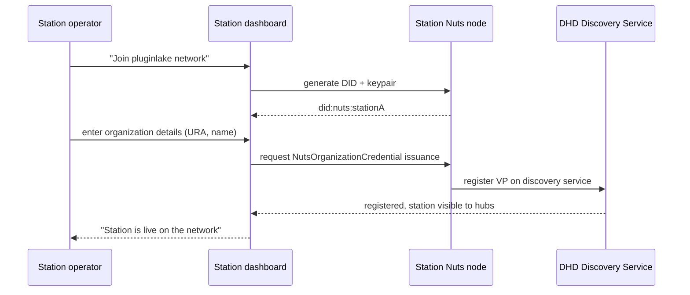

**Approving a hub connection:**

When a hub initiates a DSP contract negotiation with the station, the station operator sees an approval request in the dashboard:

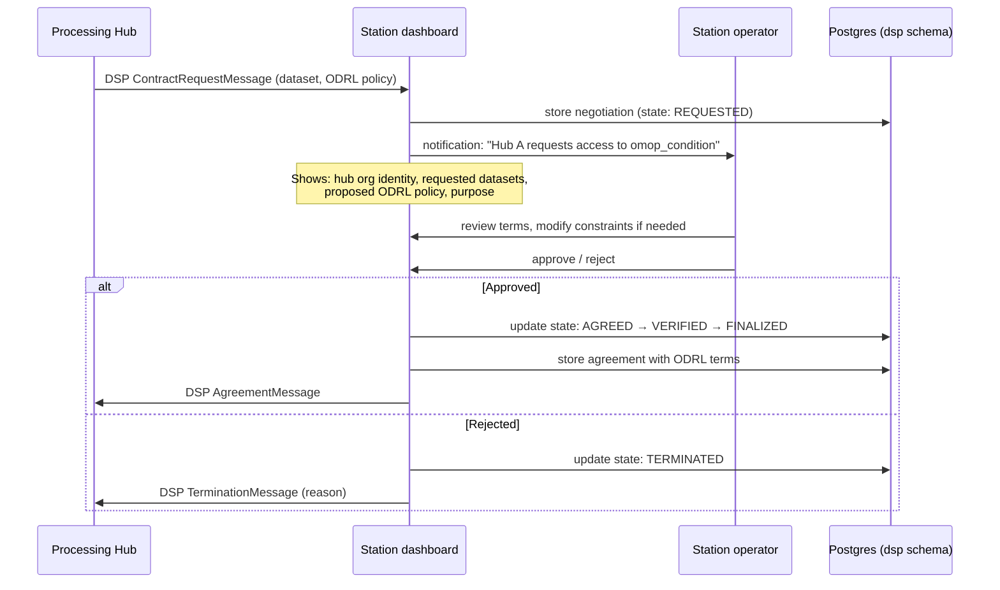

**Configuring station-level access constraints:**

The station dashboard provides a policy editor where the data holder can configure:

- Which datasets are externally visible in the DSP catalog (Dagster tag `pluginlake/external: "true"`)
- Per-dataset column allowlists/denylists
- Row filter conditions (e.g. date ranges, minimum cohort sizes)
- Privacy thresholds (k-anonymity, differential privacy budget)
- Compute restrictions (aggregate-only, no raw extraction)
- Station-local overrides (datasets never shared regardless of agreement)

These settings are stored in the station's asset registry (`station_assets.yaml`) and operation registry (`station_operations.yaml`). Changes take effect on the next request (no reload delay).

### Hub operator workflow

A hub operator manages the processing hub, its connected stations, and its users.

**Connecting to a station:**

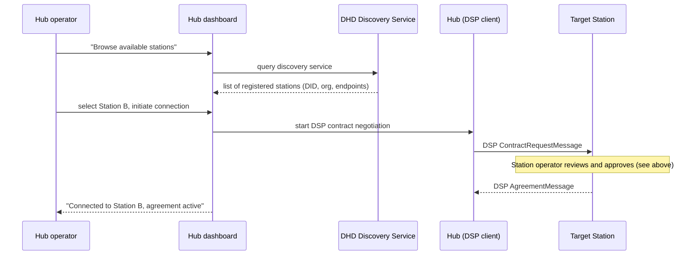

**Managing users:**

The hub dashboard provides user management:

- Add/remove researchers (OIDC accounts via hub's IdP or federated)
- Assign roles (analyst, lead researcher, admin)
- Map users to agreements: which user is authorized to use which active DSP agreement
- Set per-user purpose constraints (user X can only make requests for purpose "observational research")

These settings feed into the hub's credential issuance logic. When a researcher makes a request, the hub checks their identity + role against the active agreements and permitted purposes, then issues a PluginlakeAccessCredential (VC) scoped to those permissions.

**Monitoring activity:**

The hub dashboard shows:

- Active agreements with each station and their status
- Recent transfer requests and their outcomes
- Decision logs: which requests were allowed/denied and why
- Dagster run status for active transfers

### Researcher workflow

A researcher interacts with the processing hub through a research interface (e.g. Streamlit app, Jupyter gateway, or dedicated UI).

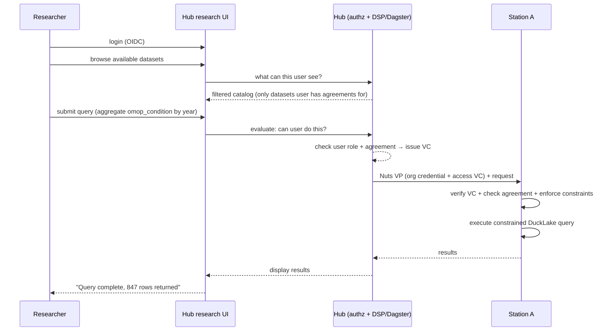

The researcher never sees Nuts tokens, VC verification, or DSP negotiations. They see a catalog of available data (pre-filtered by their permissions) and submit queries. The authorization is invisible.

### How approval flows connect the components

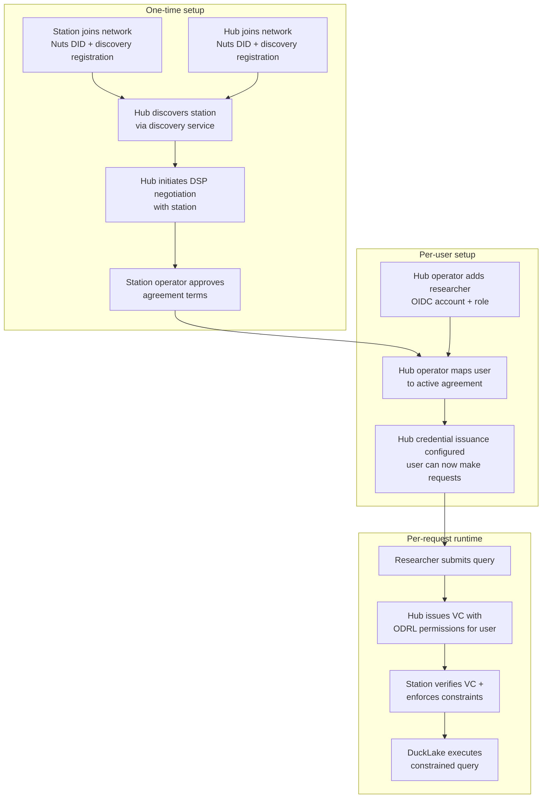

## Governance models: who approves access

### The problem: approval authority varies by network

The architecture must not hardcode who approves access. In practice, three governance models exist and a single pluginlake deployment may encounter all three:

**Model 1: Data holder governed.** The hospital's DPO or data steward decides what leaves their station. The station operator reviews and approves each DSP contract negotiation individually. This is the default model described in EHDS Article 50+ and the Health-RI data station specification.

**Model 2: Collaboration governed.** A research consortium or network coordinator defines the access terms upfront for all stations in the network. Individual station operators do not approve each request -- they delegate that authority to the collaboration when joining. The collaboration coordinator configures which hubs can access which datasets across all stations.

**Model 3: Hybrid.** The collaboration sets baseline access terms, but individual station operators can add restrictions (never share certain columns, require higher k-anonymity). The collaboration cannot override station-local constraints -- data holder sovereignty is preserved.

### How this maps to DSP + VC enforcement

The DSP Agreement is the formal artifact that captures the approved access terms regardless of who approved them. The approval workflow differs, but the runtime enforcement is identical:

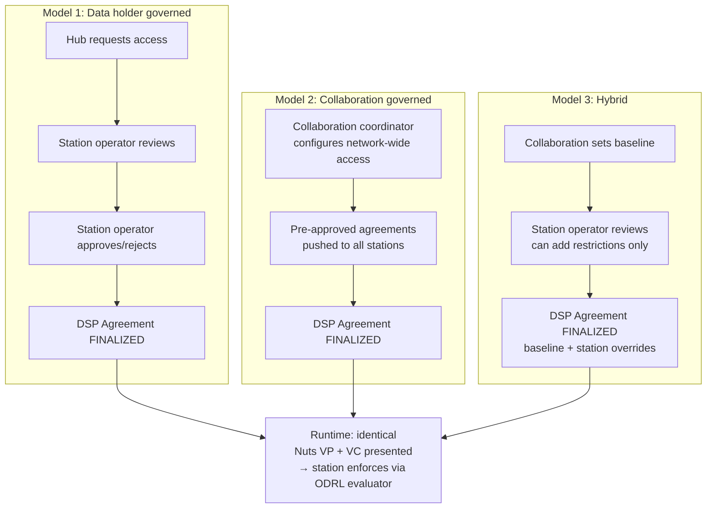

Once a DSP Agreement is FINALIZED — regardless of who finalized it — the VC-based enforcement works identically. The station verifies the VC, cross-references the agreement, and applies its own constraints. It does not need to know whether the agreement was approved by a local operator or pushed by a collaboration coordinator.

### The collaboration coordinator role

In Model 2 and Model 3, a new role exists: the collaboration coordinator. This is an operator with network-wide visibility who can:

- Define which hubs participate in the collaboration
- Define which datasets across which stations are in scope
- Pre-configure DSP agreements for all station-hub pairs in the network
- Configure credential issuance rules that reflect the collaboration's access terms

The collaboration coordinator operates through the hub dashboard (or a dedicated governance UI) and pushes pre-approved agreements to stations. Stations in Model 2 auto-accept these agreements (the station's Nuts Bolt policy includes the collaboration's credential as a trusted issuer). Stations in Model 3 receive the agreement as a proposal that the local operator can only tighten, not relax.

### Translating approval into transaction-level verification

The formal contract approval process (DSP negotiation → FINALIZED agreement) translates directly into transaction-level verification of fine-grained permissions:

```
Approval (one-time, any governance model)
  → DSP Agreement stored in both hub and station Postgres
  → Agreement contains: datasets, operations, purpose, ODRL policy terms
  → Agreement ID referenced in every subsequent transaction

Transaction (per-request, runtime)
  → Hub checks user against agreement → issues VC with agreement_id + ODRL permissions
  → Station verifies VC signature + checks agreement_id against stored agreement
  → If agreement is active + not expired + constraints satisfied → allow
  → ODRL evaluator applies fine-grained constraints from agreement + VC + station config
  → DuckLake query executes within bounds
  → Decision logged with agreement_id for audit
```

Every transaction is traceable back to the formal agreement that authorized it. The agreement_id in the VC is the link between the governance approval and the runtime enforcement. This satisfies the EHDS requirement that every secondary use of health data is traceable to a specific permit.

### Station-local overrides are always authoritative

Regardless of governance model, the data holder retains sovereignty. Station-local restrictions (in `station_assets.yaml` and `station_operations.yaml`) can deny access that the collaboration or agreement would otherwise allow. This is enforced architecturally: the ODRL evaluator intersects VC claims with station-local config, and the most restrictive combination wins. The collaboration coordinator cannot push configuration that overrides local restrictions.

This means:
- A collaboration can grant access to `omop_condition` across all stations
- But if Hospital A's asset registry marks `person_id` as a sensitive column, that column is never returned from Station A regardless of what the agreement says
- The enforcement layer applies this at query time
- The hub and collaboration coordinator see the denial in the decision log but cannot override it

## Role-based access control for hub and station operators

### The problem

DSP contract negotiations and agreement approvals are high-stakes operations -- they define what data leaves a hospital and under what terms. These operations must be restricted to operators with explicit authority. A researcher must never be able to initiate or approve a DSP agreement. A junior hub operator must not be able to modify network-wide collaboration policies.

### Proposed roles

Two separate RBAC hierarchies exist: one for the processing hub, one for the data station. They are managed independently -- a person may hold roles on both, but the roles do not inherit across systems.

#### Processing hub roles

| Role | Can do | Cannot do |
|---|---|---|
| **Network admin** | Initiate DSP negotiations with stations. Accept/reject agreements. Configure collaboration-wide access policies. Manage hub operator accounts. Configure credential issuance rules. | Access research data. Submit queries. |
| **Hub operator** | Add/remove researchers. Map users to active agreements. Assign user roles and purpose constraints. View decision logs. Monitor transfer status. | Initiate or approve DSP agreements. Modify collaboration-wide policies. |
| **Researcher** | Browse permitted catalog. Submit queries/analytics within their permitted scope. View own results. | See other users' results. Modify permissions. Initiate agreements. See full decision logs. |

#### Data station roles

| Role | Can do | Cannot do |
|---|---|---|
| **Station admin** | Accept/reject incoming DSP agreement requests. Configure station-level access policy (column allowlists, row filters, privacy thresholds via asset/operation registry). Add station-local overrides. Register/deregister station on discovery service. Manage station operator accounts. | Override collaboration-level agreements to be more permissive (can only tighten). |
| **Station operator** | View incoming agreement requests (read-only). Monitor active transfers and decision logs. View station health and Dagster run status. | Approve/reject agreements. Modify station policy. |

### Agreement approval workflow with role enforcement

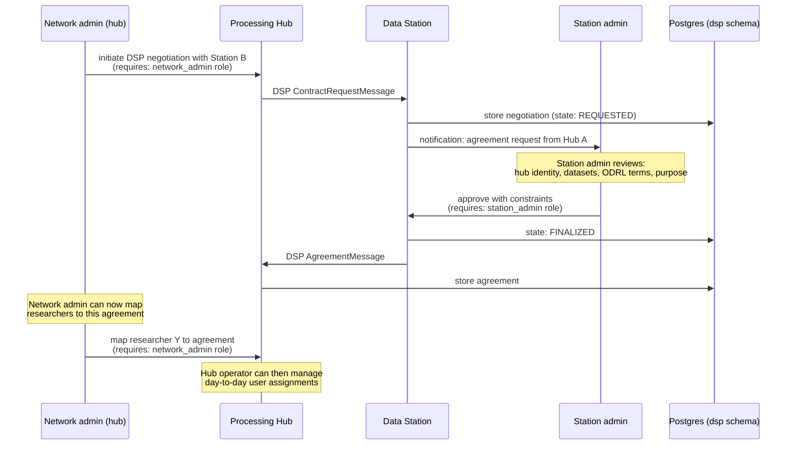

### Role verification at the API level

Every DSP-related endpoint on the FastAPI gateway checks the caller's role before proceeding:

```python
# Hub-side: only network_admin can initiate negotiations
@router.post("/dsp/negotiations")
async def initiate_negotiation(
    request: ContractRequestMessage,
    user: User = Depends(require_role("network_admin"))
):
    ...

# Station-side: only station_admin can approve/reject
@router.post("/dsp/negotiations/{id}/events")
async def negotiation_event(
    id: UUID,
    event: NegotiationEvent,
    user: User = Depends(require_role("station_admin"))
):
    ...

# Hub-side: hub_operator or network_admin can map users to agreements
@router.post("/api/users/{user_id}/agreements")
async def assign_user_agreement(
    user_id: str,
    assignment: AgreementAssignment,
    user: User = Depends(require_role("hub_operator", "network_admin"))
):
    ...
```

### Audit trail for administrative actions

All role-gated actions are logged separately from per-transaction decision logs:

- Who initiated the negotiation, when, with which station
- Who approved/rejected the agreement, when, with what modifications
- Who mapped which researcher to which agreement
- Who modified station access policy (asset registry, operation registry) and what changed

This administrative audit trail is distinct from the per-transaction enforcement decision log. Together they provide full traceability from governance decision to data access.

### Identity and RBAC data model

The RBAC model is anchored on organizations, not on individual pluginlake instances. A user belongs to an organization and can be granted roles on any instance (hub or station) that the organization operates. Nuts DIDs tie instances to organizations, and the same organizational identity in Nuts enables cross-instance role assignment within that org.

#### Entity model

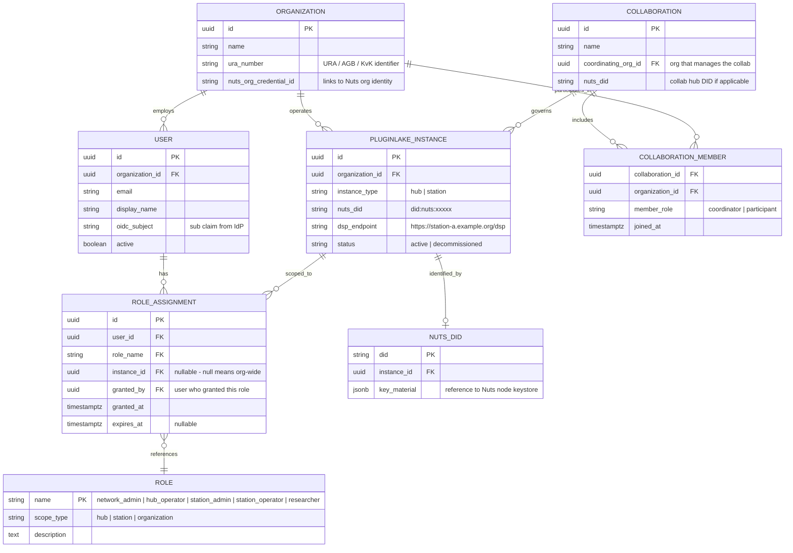

#### Role definitions and scope

Roles are scoped at three levels: organization-wide, per-hub, or per-station. A role assignment with `instance_id = null` applies to all instances operated by that organization.

| Role | Scope | Description |
|---|---|---|
| `network_admin` | hub | Initiate/approve DSP negotiations. Configure collaboration-wide access policies. Manage hub operators and researchers. Configure credential issuance rules. |
| `hub_operator` | hub | Add/remove researchers. Map users to agreements. Monitor activity. Cannot initiate or approve agreements. |
| `researcher` | hub | Browse permitted catalog. Submit queries. View own results. No admin capabilities. |
| `station_admin` | station | Accept/reject DSP agreements. Configure station access policy (asset/operation registry). Manage station operators. Register/deregister on discovery service. |
| `station_operator` | station | Monitor station health, transfers, decision logs. Read-only on agreements and policy. |
| `org_admin` | organization | Manage users and role assignments across all instances in the org. Cannot override station-level or hub-level policy decisions. |

#### Cross-instance administration via organization

A user with `org_admin` role can manage roles on any instance their organization operates. This is how a single hospital IT admin manages both their data station and their processing hub without needing separate accounts:

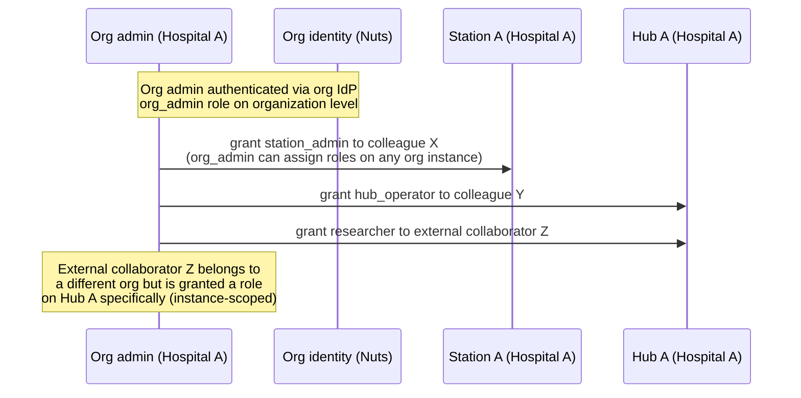

#### External collaborators

A researcher from Organization B can be granted a role on Hub A (operated by Organization A) without being a member of Organization A. This is handled by instance-scoped role assignment:

- The researcher authenticates via their own organization's IdP (federated OIDC)
- Hub A's `network_admin` or `org_admin` creates a role assignment with `user_id` pointing to the federated user and `instance_id` pointing to Hub A
- The researcher appears in Hub A's user list with their home organization clearly labeled
- The researcher's access is fully governed by Hub A's credential issuance policies and agreement mappings

This supports the common scenario where a research consortium has members from multiple hospitals, all accessing data through a shared processing hub.

#### How Nuts organizational identity connects to RBAC

The `organization.nuts_org_credential_id` links the RBAC organization to its Nuts network identity. When a Nuts token arrives at a station, the station resolves the hub's DID to an organization, then looks up role assignments for users in that organization context:

```
Incoming request:
  Nuts VP → hub DID: did:nuts:hubA
  VC (PluginlakeAccessCredential) → user_id: researcher-Y, agreement_id: abc123

Station resolves:
  did:nuts:hubA → pluginlake_instance.id = hub-A
  hub-A → organization_id = org-X
  researcher-Y → role_assignment where instance_id = hub-A, role = researcher
  → verified: researcher-Y has researcher role on hub-A
  → proceed to ODRL enforcement with verified role context
```

The station does not need to query Hub A's IdP. It trusts the hub-signed VC for user identity (verified by VC signature against hub's DID document key) and checks its own role assignment table for authorization. Role assignments for external collaborators on a hub are replicated to connected stations as part of the DSP agreement metadata.

#### Collaboration governance in the RBAC model

A collaboration (e.g. a multi-hospital research consortium) is modeled as a separate entity with member organizations. The collaboration may operate its own hub instance (with its own Nuts DID) or designate one member's hub as the collaboration hub.

The `coordinating_org_id` on the collaboration determines which organization's `org_admin` or `network_admin` can configure collaboration-wide policies. Member organizations retain `station_admin` authority over their own stations -- the collaboration coordinator can push agreements but station admins can only tighten constraints, never relax them.

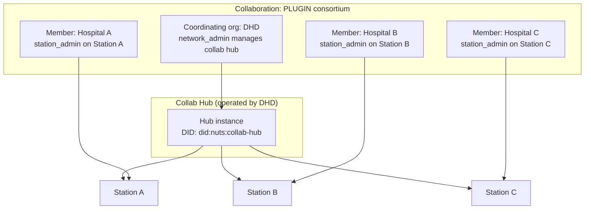


## Enforcement: translating contracts to compute and data

> This section describes the enforcement architecture at a high level. The detailed specification of query safety, filter validation, algorithm approval, and container sandboxing is deferred to **ADR-009: Contract-to-compute mapping and query safety**.

### The translation problem

An ODRL permission says "you may aggregate omop_condition for scientific research." The station must translate this abstract statement into a concrete DuckLake query or Dagster job execution with the correct constraints applied.

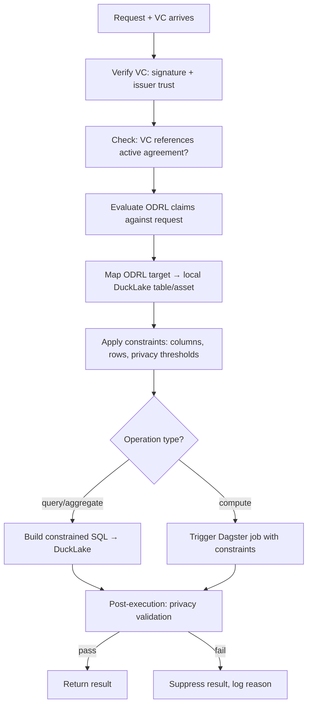

### Station asset registry

Each station maintains a local registry that maps ODRL target URNs to its concrete local assets. This is station-specific because different hospitals may use different schemas, table names, or asset configurations for the same logical dataset.

```yaml
# Station-local config: station_assets.yaml
assets:
  "urn:pluginlake:dataset:omop_condition":
    dagster_asset_key: ["omop", "condition_occurrence"]
    ducklake_schema: "omop"
    ducklake_table: "condition_occurrence"
    available_columns:
      - condition_concept_id
      - condition_start_date
      - condition_end_date
      - condition_type_concept_id
      - visit_occurrence_id
    sensitive_columns:
      - person_id    # never exposed externally regardless of VC claims
    external: true   # visible in DSP catalog

  "urn:pluginlake:dataset:omop_drug_exposure":
    dagster_asset_key: ["omop", "drug_exposure"]
    ducklake_schema: "omop"
    ducklake_table: "drug_exposure"
    available_columns:
      - drug_concept_id
      - drug_exposure_start_date
      - drug_exposure_end_date
      - quantity
    sensitive_columns:
      - person_id
    external: true

  "urn:pluginlake:dataset:omop_person":
    dagster_asset_key: ["omop", "person"]
    ducklake_schema: "omop"
    ducklake_table: "person"
    external: false  # never exposed in DSP catalog
```

### Station operation registry

Operations define what compute patterns are available. Each operation maps to a concrete execution strategy.

```yaml
# Station-local config: station_operations.yaml
operations:
  "pluginlake:aggregate":
    type: sql_template
    description: "Grouped aggregation with count"
    sql: "SELECT {columns}, COUNT(*) as n FROM {schema}.{table} {where} GROUP BY {columns}"
    requires_group_by: true
    min_group_size: 5  # k-anonymity: suppress groups smaller than this

  "pluginlake:count":
    type: sql_template
    description: "Simple count"
    sql: "SELECT COUNT(*) as n FROM {schema}.{table} {where}"

  "pluginlake:query":
    type: sql_constrained
    description: "Column-restricted SELECT with row filters"
    sql: "SELECT {columns} FROM {schema}.{table} {where} LIMIT {max_rows}"
    max_rows_default: 10000

  "pluginlake:federated_learning":
    type: dagster_job
    description: "Federated learning training round"
    job_name: "fl_training_round"
    container_image: "pluginlake/fl-worker:latest"
    allowed_parameters:
      - model_type
      - epochs
      - batch_size

  "pluginlake:cohort_count":
    type: dagster_asset
    description: "Pre-defined cohort count asset"
    asset_key: ["analytics", "cohort_count"]
```

### Constraint enforcement at query time

When a request arrives, constraints from three sources are merged (most restrictive wins):

```
Agreement constraints (from DSP negotiation):
  datasets: [omop_condition]
  operations: [aggregate, count]
  purpose: scientific-research

VC constraints (from presented credential):
  datasets: [omop_condition]
  operations: [aggregate]
  columns: [condition_concept_id, condition_start_date]

Station-local restrictions (from config):
  sensitive_columns: [person_id]  → always denied
  min_k_anonymity: 5             → suppress small groups
  max_result_rows: 50000         → hard limit

Merged enforcement (most restrictive wins):
  table: omop.condition_occurrence
  columns: [condition_concept_id, condition_start_date]  (VC restricted)
  person_id: DENIED (station restriction)
  operation: aggregate
  k-anonymity: 5 (station threshold)
```

The enforcement logic in Python:

```python
# src/pluginlake/authz/enforcement.py
@dataclass
class EnforcedQuery:
    sql: str
    parameters: dict
    privacy_checks: list[PrivacyCheck]
    audit_metadata: AuditRecord

def enforce_request(
    vc_claims: AccessCredentialClaims,
    agreement: DSPAgreement,
    request: DataRequest,
    asset_registry: AssetRegistry,
    operation_registry: OperationRegistry,
    station_policy: StationPolicy,
) -> EnforcedQuery | Denial:
    """Translate a verified request into a constrained executable query."""

    # 1. Resolve target to local asset
    asset = asset_registry.resolve(request.target)
    if not asset or not asset.external:
        return Denial("dataset not available")

    # 2. Check operation is allowed by agreement AND vc AND station
    if request.operation not in agreement.permitted_operations:
        return Denial("operation not in agreement scope")
    if request.operation not in vc_claims.permitted_operations:
        return Denial("operation not in credential scope")

    # 3. Compute allowed columns (intersection, minus sensitive)
    allowed_columns = (
        set(asset.available_columns)
        & set(vc_claims.permitted_columns or asset.available_columns)
        - set(asset.sensitive_columns)
    )

    # 4. Build constrained query from operation template
    # NOTE: request.filters uses a structured filter AST (not raw SQL).
    # Only allowed columns/operators are accepted. Values are parameterized.
    # Station row constraints are combined with AND before SQL generation.
    # Full filter validation and query-to-compute mapping is specified in ADR-009.
    operation = operation_registry.resolve(request.operation)
    query = operation.build_sql(
        schema=asset.ducklake_schema,
        table=asset.ducklake_table,
        columns=allowed_columns,
        where=request.filters,  # structured AST, validated + parameterized
        max_rows=station_policy.max_result_rows,
    )

    # 5. Attach privacy checks for post-execution validation
    privacy_checks = [
        KAnonymityCheck(min_k=station_policy.min_k_anonymity),
        MaxCardinalityCheck(max_rows=station_policy.max_result_rows),
    ]

    return EnforcedQuery(sql=query, parameters={}, privacy_checks=privacy_checks, ...)
```

### Post-execution privacy validation

After the query executes, results are validated before returning:

```python
# src/pluginlake/authz/privacy.py
def validate_result(
    result: pl.DataFrame,
    privacy_checks: list[PrivacyCheck],
) -> pl.DataFrame | Denial:
    """Validate query results against privacy constraints."""
    for check in privacy_checks:
        result = check.apply(result)
        if result is None:
            return Denial(f"privacy check failed: {check.description}")
    return result

class KAnonymityCheck(PrivacyCheck):
    """Suppress groups with fewer than k records."""
    min_k: int = 5

    def apply(self, df: pl.DataFrame) -> pl.DataFrame | None:
        if "n" in df.columns:
            return df.filter(pl.col("n") >= self.min_k)
        return df
```

### Docker containers for custom compute

For operations that require custom compute (federated learning, complex analytics), the credential grants access to specific Dagster jobs that run in isolated Docker containers:

```
VC says: action = "pluginlake:federated_learning"
              target = "urn:pluginlake:dataset:omop_condition"

Station resolves:
  operation_registry["pluginlake:federated_learning"]
    → type: dagster_job
    → job_name: "fl_training_round"
    → container_image: "pluginlake/fl-worker:latest"

Station executes:
  POST /api/assets/fl_training_round/materialize
    with config: {
      dataset: "omop.condition_occurrence",
      columns: [allowed columns only],
      parameters: [from request, validated against allowed_parameters]
    }
  → Dagster launches Docker container with constrained access
  → Container can only read the columns/rows it was given
  → Result returned via transfer process
```

The Docker container does not have direct DuckLake access — it receives a pre-filtered dataset as input. This ensures the container cannot read data beyond what the credential grants.

### How the DSP catalog maps to the asset registry

The DSP catalog endpoint (`GET /dsp/catalog`) is automatically generated from the station's asset registry. Only assets with `external: true` appear in the catalog:

```python
# src/pluginlake/dsp/routes.py
@router.get("/dsp/catalog")
async def get_catalog(registry: AssetRegistry = Depends(get_asset_registry)):
    datasets = []
    for urn, asset in registry.items():
        if asset.external:
            datasets.append({
                "@type": "dcat:Dataset",
                "@id": urn,
                "dct:title": asset.ducklake_table,
                "odrl:hasPolicy": build_catalog_offer(asset),
            })
    return {"@type": "dcat:Catalog", "dcat:dataset": datasets}
```

This ensures the catalog always reflects what the station is actually willing to share. If a station admin sets `external: false` on a dataset, it disappears from the catalog immediately.

### Tooling decisions

| Component | Tool | Rationale |
|---|---|---|
| ODRL profile evaluation | **Build: ~300 lines Python** | No production-grade Python library exists. `pyodre` (2 stars, dormant) is unsuitable. Our constrained profile is small enough to evaluate directly. |
| VC signature verification | **`PyJWT` + `cryptography`** | Production-grade, well-maintained. Verify JWT-based VCs. For JSON-LD Data Integrity proofs, use `pyld` + `cryptography`. |
| JSON-LD processing | **Pydantic (primary) + `pyld` (optional)** | Pydantic handles compacted JSON-LD directly. `pyld` added later if external connectors send expanded form. |
| Nuts node client | **Auto-generate from OpenAPI spec** | Nuts node exposes OpenAPI. Use `openapi-python-client` to generate typed Python client. |
| DSP protocol implementation | **Build: Pydantic models + FastAPI routes** | No reusable Python DSP library exists. `edcpy` requires Java EDC backend. Build native implementation. |
| Privacy checks (k-anonymity) | **Build: Polars-based** | Simple post-query validation. ~50 lines per check type. |
| Policy storage | **Pydantic Settings + YAML** | Station-local config. No external policy engine needed. |

---

## Nuts constraints and design considerations

For detailed Nuts integration constraints (one node per instance, Discovery Service, DPoP validation, FHIR credential model, `localParameters` limitations, scope granularity), see [ADR-006: Nuts Node Integration](../decisions/adr-006-nuts-node-decentralized-auth.md#nuts-constraints-and-design-considerations).

**Key principle for this ADR:** Nuts handles organizational membership only. Per-dataset access control is not achievable at the Nuts layer. Fine-grained per-user permissions belong in the PluginlakeAccessCredential (VC with ODRL profile), not in Nuts credentials.

---

## DSP constraints (Eclipse Dataspace Protocol 2025-1)

### JSON-LD is mandatory

All DSP messages use JSON-LD. External connectors (especially EDC-based) may send compacted or expanded representations. Pydantic handles compacted form natively; add `pyld` for expansion/normalization if needed for interop with external connectors.

### Provider must push state callbacks

Even with pull data transfer, the Transfer Process requires outbound HTTP callbacks from provider to consumer on state changes. Dagster sensors handle this, but sensor reliability determines callback reliability.

### No negotiation timeout defined

DSP specifies no timeout for negotiations. Pluginlake must define its own timeout policy.

### Dagster materialization is not idempotent

Consumer retries can trigger duplicate runs. The transfer state machine must check for in-progress runs before triggering new ones.

---

## Phased delivery

The full architecture (DSP + Nuts + ODRL profile + VC-based credentials + enforcement registry + RBAC) is substantial. Delivery is phased to validate each layer before building the next.

### Phase 1: Single-station DSP provider with Nuts identity

**Goal:** One data station can receive DSP requests from one processing hub, authenticated via Nuts. Basic contract negotiation works end-to-end. Hub-side DSP client is NOT in scope (tested with manual/scripted requests).

**Delivers:**
- `src/pluginlake/dsp/` module: DSP provider routes on FastAPI (catalog, negotiation, transfer)
- Nuts middleware for organizational identity verification (auto-generated client)
- Contract negotiation state machine (Postgres `dsp` schema)
- Transfer process state machine backed by Dagster
- Pull transfer with scoped token
- Station asset registry (YAML config: which assets are externally visible)
- Single hub, single station, manually configured
- Integration test client (simulates hub DSP consumer requests)

**Does not include:** hub-side DSP client, per-user credentials, multi-hub, RBAC dashboard, ODRL evaluation, collaboration governance.

### Phase 2: VC-based credentials and ODRL profile evaluation

**Goal:** Per-user authorization at the station. Hub issues credentials, station verifies and enforces.

**Delivers:**
- `src/pluginlake/authz/` module: ODRL profile evaluator, VC verification, enforcement layer
- PluginlakeAccessCredential schema definition (ADR-009)
- Hub issues VCs to researchers (signed by hub DID)
- Station verifies VC at request time + cross-checks against active agreement
- Station operation registry (YAML: maps actions to SQL templates / Dagster jobs)
- Constraint enforcement (column filtering, row limits)
- Post-execution privacy checks (k-anonymity)
- Hub signing key distribution (via Nuts DID document)
- Multi-hub topology tested

### Phase 3: UI, governance, and collaboration

**Goal:** Production-ready multi-organization network with operator dashboards and collaboration support.

**Delivers:**
- Hub UI (Streamlit `central`): credential issuance, user management, agreement monitoring
- Station UI (Streamlit `datastation`): access control dashboard, agreement approval, restrictions config
- RBAC entity model (roles, assignments, organizations, collaborations)
- Governance models (data holder governed, collaboration governed, hybrid)
- Decision logging and audit trail
- Credential revocation (StatusList2021)
- Collaboration coordinator workflow

---

## Consequences

- pluginlake gains a DSP-compliant external surface aligned with the Health-RI data station specification and EHDS requirements
- The processing hub specification (Health-RI §4.4, currently undefined) will be informed by this ADR's credential model and enforcement architecture
- Every station runs two sidecars: Nuts node and Dagster code server. OPA is not required — enforcement is built into the pluginlake `authz` module using the ODRL profile evaluator.
- The pluginlake ODRL profile (credential schema + actions + constraint types) is the highest priority deliverable. Without it, stations from different organizations cannot interoperate.
- Hub signing key distribution must be resolved (options: key in Nuts DID document, key exchanged during DSP negotiation, key published via discovery registration parameters)
- Station asset registry and operation registry must be defined per station (station-local YAML config)
- Collaboration hubs need a governance decision on organizational identity before deployment
- ODRL policies are evaluated against a constrained profile (Level 2) — not full ODRL. Profile extensibility is planned for future phases.
- A new `src/pluginlake/authz/` module and `src/pluginlake/dsp/` module are required
- The Streamlit UI gets new pages: credential management (central) and access control (datastation)

---

## Design risks by severity

| Risk | Severity | Blocker? |
|---|---|---|
| ODRL profile not standardized → stations incompatible | High | Yes, must define before multi-org deployment |
| Hub signing key distribution mechanism undefined | Medium | Must resolve before implementation |
| Custom ODRL evaluator correctness (no reference impl to test against) | Medium | Mitigate with comprehensive test suite + DSP TCK |
| Collaboration hub credential issuance → governance gap | Medium | Must resolve per collaboration |
| No existing Bolt for research data exchange | Medium | No, ship as default policy file |
| Sensor reliability for outbound DSP callbacks | Medium | No, mitigatable with retry tracking |
| Nuts node per station requires outbound network | Medium | Verify per hospital firewall policy |
| No prior Nuts + DSP + ODRL implementation as reference | Medium | No, budget extra integration testing time |
| Credential re-issuance cost for permission changes | Medium | Mitigate with short-lived VCs + automated issuance |
| DPoP validation adds latency per request | Low | No, Nuts convenience API handles it |
| Dagster materialization not idempotent | Low | No, mitigatable with idempotency check |
| SUSPENDED state not supported in v1 | Low | No, document as known gap |

---

## Open questions

### Must resolve before implementation

1. **Pluginlake ODRL profile specification** -- define the exact actions (`pluginlake:aggregate`, `pluginlake:query`, `pluginlake:count`, `pluginlake:compute`), constraint types (`purpose`, `dateTime`, `maxCardinality`, `columns`), and asset URN scheme (`urn:pluginlake:dataset:{name}`).
2. **PluginlakeAccessCredential schema** -- the VC type, required fields, issuer rules, how ODRL permissions are embedded. Candidate for ADR-009.
3. **Hub signing key distribution** -- how stations learn to trust hub signing keys. Likely resolved by: hub's DID document contains the signing key, station resolves DID via Nuts network.
4. **Collaboration hub credential issuance** -- governance decision per collaboration.

### Deferred to ADR-009: Contract-to-compute mapping and query safety

The following questions are in scope for ADR-009 (not resolved here):

5. **Structured filter AST and query parameterization** -- requests must use a validated filter structure (not raw SQL). Define allowed operators, column references, and how values are parameterized to prevent injection/bypass.
6. **Pre-approved algorithm and container registry** -- which Docker images, Dagster jobs, and query patterns are allowed. How new algorithms get reviewed and approved before they can be referenced in a contract.
7. **Privacy validation for non-aggregate queries** -- k-anonymity checks only apply to grouped results. Define what privacy controls apply to raw row-level queries (cohort-size thresholds, output-shape validation, or disabling raw query by default for clinical data).
8. **Station-side credential/role synchronization** -- whether stations maintain local role lookups (replicated from hub) or rely purely on the VC presented per-request. Define revocation semantics, freshness guarantees, and what happens when a VC references a user the station has never seen.
9. **Collaboration governance and trust boundary separation** -- how collaboration auto-approval works without blurring Nuts (network membership) and pluginlake (fine-grained authorization). Likely: separate governance credential/config checked by pluginlake, not by the Nuts Bolt.
10. **Techniques to limit destructive or data-exfiltrating operations** -- sandboxing, network isolation, output size limits, differential privacy budgets, and how to detect/prevent side-channel exfiltration from approved containers.

### Can resolve during implementation

11. **IdP topology for hubs** -- Keycloak vs federated hospital IdPs (SURFconext, Microsoft Entra ID). Can differ per hub initially.
12. **ODRL profile extensions** -- additional actions and constraints can be added as needs emerge. Profile is versioned.
13. **Discovery service definition** -- JSON service definition for pluginlake. Ship as default.
14. **Negotiation timeout** -- operational decision.
15. **Credential validity duration** -- balance between short-lived (frequent re-issuance, fine-grained revocation) and long-lived (less operational overhead). Start with 24-hour VCs, adjust based on operational experience.
16. **Processing hub specification alignment** -- contribute pluginlake's model to Health-RI §4.4 as the specification matures.
17. **Processing hub DSP client implementation (v2)** -- hub-side DSP consumer/client, including catalog browsing, negotiation initiation, transfer request, and result retrieval.

## Appendix A: International standards and ontologies for data contracts

> **Editorial note:** This appendix catalogues the international standards relevant to pluginlake's authorization and contract architecture. It is reference material to inform vocabulary and schema design decisions.

When designing an enterprise-grade data space — especially in a highly regulated landscape like the European Health Data Space (EHDS) — you should avoid inventing custom schemas. Several mature international standards and ontologies govern data contracts and policies:

### W3C ODRL 2.2 (Open Digital Rights Language)

*The standard for usage control.*

* **What it is:** The premier W3C standard ontology for expressing policies, permissions, prohibitions, and obligations.
* **Why it matters here:** The **Eclipse Dataspace Protocol (DSP) natively utilizes ODRL** to model contract negotiations, contract offers, and contract agreements. In a dataspace, an ODRL Contract Agreement is the definitive technical "Data Contract." It defines exactly what a consumer is allowed to do with a dataset (e.g., `odrl:Permission` to read, under the `odrl:Constraint` of a valid permit). pluginlake uses a constrained ODRL profile (Level 2) for its PluginlakeAccessCredential.

### W3C DPV (Data Privacy Vocabulary)

*The standard for legal bases and purposes.*

* **What it is:** A highly active, community-driven W3C ontology explicitly designed to provide machine-readable metadata about the processing of personal data, purposes, legal bases (like GDPR or DGA), and technical/organisational measures.
* **Why it matters here:** DPV provides a native guide for integration with ODRL (`GUIDE-ODRL`). For the EHDS, DPV allows you to taxonomically declare the *exact legal purpose of data use* (e.g., `dpv:ScientificResearch` or `dpv:PublicHealthOversight`) within both the Nuts credential and the ODRL policy, ensuring semantic alignment across different European health authorities.

### OASIS XACML (eXtensible Access Control Markup Language)

*The standard for access architecture.*

* **What it is:** An international standard that defines both an XML-based policy language and a strict architectural paradigm for Attribute-Based Access Control (ABAC).
* **Why it matters here:** While XACML's XML language has been superseded in modern stacks by JSON and domain-specific languages, its **architectural concepts remain relevant**: the PEP (Policy Enforcement Point — the HTTPS gateway), the PDP (Policy Decision Point — the ODRL evaluator), and the PIP (Policy Information Point — the asset/operation registry). pluginlake's enforcement layer follows this structural pattern without XACML's verbosity.

### The IDSA Information Model (International Data Spaces)

* **What it is:** An RDFS/OWL ontology developed by the International Data Spaces Association. It builds a comprehensive semantic layer over data assets, participants, connectors, and usage contracts.
* **Why it matters here:** It blends ODRL with specialized data space concepts, creating standard definitions for "Contract Agreements" that legally bind data transactions between multi-party connectors.

### ODCS (Open Data Contract Specification)

*The standard for data ops and mesh.*

* **What it is:** A rapidly growing open-source community standard (found at `datacontract.com`) utilized heavily in modern data engineering and data mesh patterns.
* **Why it matters here:** It is important to distinguish this from ODRL. While ODRL handles *legal compliance, permissions, and usage rights*, ODCS handles *operational mechanics* (schema validation, data quality thresholds, freshness SLAs, and column-level formatting).

### How these standards compose in pluginlake

For a comprehensive EHDS-aligned design, these standards fit together as a composable stack:

1. **The Legal/Regulatory Layer:** Governed by **W3C DPV** to define valid health purposes and legal bases.
2. **The Data Space Protocol Layer:** Governed by **W3C ODRL** via the Eclipse Dataspace Protocol to draft the formal multi-party Contract Agreement.
3. **The Identity & Evidence Layer:** Governed by **W3C Verifiable Credentials** (via Nuts) to securely carry the DPV-aligned claims as cryptographic evidence.
4. **The Enforcement Layer:** The pluginlake ODRL profile evaluator maps the incoming ODRL-negotiated constraints (from the VC) against station-local policy (asset + operation registry) and executes the constrained query.
