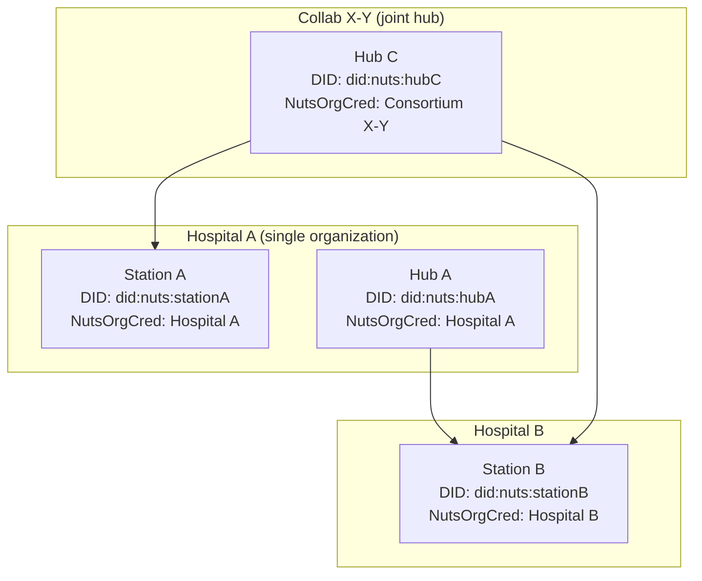

# ADR-006: Nuts Node integration for decentralized organizational identity

**Status:** Accepted
**Date:** 2026-03-19 (revised 2026-05-28)

## TL;DR

This ADR defines how pluginlake integrates [Nuts](https://nuts-node.readthedocs.io/) as the decentralized identity layer for inter-node communication (trust boundary 2: node-to-node). Nuts handles organizational identity only. Per-user authorization, contract negotiation, and enforcement are defined in [ADR-008](adr-008-dataspace-protocol-authz-authc-rbac.md).

**Scope of Nuts in pluginlake:**

| Nuts does | Nuts does NOT do |
|---|---|
| Prove which organization operates a node | Decide what a specific user may access |
| Establish bilateral trust between nodes | Negotiate data access contracts (→ DSP, ADR-008) |
| Provide network membership discovery | Enforce per-dataset or per-query permissions (→ ODRL, ADR-008) |
| Validate DPoP proofs per request | Issue or verify per-user credentials (→ PluginlakeAccessCredential, ADR-008) |

---

## Context

pluginlake is a federated data lakehouse where hospitals run data stations and research coordinators run processing hubs.
Nodes need to identify each other without relying on a single central identity provider.

Requirements:

- Authenticate requests between nodes without a central auth server.
- Prove organizational identity cryptographically (which hospital, which research institute).
- Provide an audit trail for healthcare compliance (NEN 7510, AVG/GDPR).
- Fit the federated model where each station is sovereign over its own data.
- Integrate with the Dutch healthcare ecosystem (Nuts is already adopted by 100+ organizations).

[Nuts Node](https://nuts-node.readthedocs.io/en/v5.4/) is an open-source, Dutch healthcare-specific infrastructure component that provides decentralized identity using W3C DIDs and Verifiable Credentials.

---

## Decision

**Adopt Nuts Node as the decentralized organizational identity layer, integrated as a FastAPI middleware sidecar. Nuts handles trust boundary 2 (node-to-node) exclusively.**

---

## Architecture

### Sidecar deployment

Each pluginlake instance (hub or station) runs a Nuts Node as a sidecar container:

```
┌──────────────────────────┐
│  pluginlake instance     │
│  ┌────────────────────┐  │
│  │  FastAPI gateway    │  │
│  │  ┌──────────────┐  │  │
│  │  │ Nuts auth    │  │  │
│  │  │ middleware   │  │  │
│  │  └──────────────┘  │  │
│  └────────────────────┘  │
│                          │
│  ┌────────────────────┐  │
│  │  Nuts Node         │  │
│  │  (sidecar)         │  │
│  │  - own DID         │  │
│  │  - NutsOrgCred     │  │
│  │  - DPoP validation │  │
│  └────────────────────┘  │
└──────────────────────────┘
         │ gRPC (mTLS)
         ▼
  Other Nuts Nodes in network
```

Docker Compose configuration:

```yaml
services:
  nuts-node:
    image: nutsfoundation/nuts-node:v5.4
    environment:
      NUTS_CONFIGFILE: /opt/nuts/nuts.yaml
    ports:
      - "127.0.0.1:1323:1323"  # internal API (localhost only)
      - "5555:5555"  # gRPC (public, mTLS)
    volumes:
      - "./config/nuts/nuts.yaml:/opt/nuts/nuts.yaml:ro"
      - "./config/nuts/certificate.pem:/opt/nuts/certificate.pem:ro"
      - "./config/nuts/key.pem:/opt/nuts/key.pem:ro"
      - "./config/nuts/truststore.pem:/opt/nuts/truststore.pem:ro"
      - "nuts-data:/opt/nuts/data"
```

### Middleware integration

The FastAPI middleware validates incoming inter-node requests:

1. Extract the access token from the `Authorization` header.
2. Validate via `POST /internal/auth/v2/dpop/validate` on the local Nuts Node (localhost, no network round-trip).
3. Populate the request context with the authenticated organizational identity (`organization_did`, `organization_name`).
4. The existing `require_role`/`require_auth` dependencies in `security.py` use this context for route-level authorization.

The middleware activates for any cross-organizational call (hub→station, station→hub). For purely local admin requests (CLI on the same machine), a local API key may be used.

### DID-per-instance model

Each pluginlake instance gets its own DID (a cryptographic keypair). A `NutsOrganizationCredential` is issued to each DID, tying it to a real-world organization.



Key properties:

- An organization running both a station and a hub has two DIDs, two Nuts nodes, but both credentials identify the same organization.
- External parties see two distinct network participants with the same organizational identity but different roles and endpoints.
- For **collaboration hubs** operated jointly by multiple organizations, the `NutsOrganizationCredential` must be issued to a named entity (foundation, consortium, or designated operator). This is a governance decision per collaboration.

### Network membership via Discovery Service (RFC022)

DHD hosts a Nuts Discovery Service server for the pluginlake network. Every hub and station registers by presenting a Verifiable Presentation containing their `NutsOrganizationCredential`. This solves:

- **"How does a new station join?"** — register at the discovery service.
- **"How do nodes find each other?"** — query the discovery service for other nodes and their DSP endpoints.
- **Network membership gate** — only nodes with a valid `NutsOrganizationCredential` can register.

The discovery server is a Nuts node with server mode enabled, not a separate infrastructure component. Only one is needed for the entire pluginlake network. Registration parameters include the `authServerURL` automatically.

---

## Researcher identity scoping

A researcher's identity is scoped to a processing hub. Each hub issues its own independent credentials and permits. There is no cross-hub identity correlation or credential sharing.

This means:

- A researcher authenticates at one processing hub and receives credentials (VCs) from that hub.
- If a researcher needs access to a different hub, that is a separate relationship with separate credentials.
- SDC checking stays within a single hub's domain (the hub tracks all queries from its researchers across all its collaborations).

This keeps the model simple and prevents SDC bypass through cross-hub query combination.

---

## Node roles

Every node in the network runs the same pluginlake software. What a node does is determined by its configuration.

| Aspect | Data station | Processing hub |
|---|---|---|
| Local data | Yes (DuckLake, OMOP CDM, FHIR) | No (data ingestion disabled) |
| Dagster assets | Query execution on local data | SDC, aggregation, dispatch |
| Nuts Node | Yes (own DID) | Yes (own DID) |
| Receives requests from | Processing hub (via Nuts VP) | Researchers (via OIDC + VC) |

A pluginlake configuration option (`role: hub` or `role: station`) activates the correct modules. The gateway enforces this role by checking the request context.

There is no separate processing hub codebase. Adding a processing hub to the network is deploying another pluginlake instance with a different config profile and its own Nuts Node.

### Dagster definitions per role

| Definitions module | Loaded on | Purpose |
|---|---|---|
| `pluginlake.definitions.omop` | Station | OMOP data ingestion assets |
| `pluginlake.definitions.fhir` | Station | FHIR data ingestion assets |
| `pluginlake.definitions.aggregate` (new) | Station | Predefined query assets, `GET /catalog`, `POST /execute` |
| `pluginlake.definitions.sdc` (new) | Hub | SDC assets, query dispatch, `POST /queries` |

These are two separate Dagster code locations, deployed on separate instances in production. Colocation on a single instance is acceptable for dev/test only (see open question §1 below).

---

## Federation topologies and SDC safety

### One hub, many stations (standard federation)

The primary model. One processing hub receives bilateral agreements (via DSP, see ADR-008) from participating hospitals. The hub aggregates results and applies SDC.

```
Hosp. A ──agreement──► Hub (IKNL oncology) ◄──agreement── Hosp. B
                              ▲
                              │
                         agreement
                              │
                          Hosp. C
```

### One hub, multiple federations (multi-scope)

A single hub can host multiple logical federations with different data scopes. IKNL could run both an oncology federation (30 hospitals, cancer tables) and a rare disease federation (12 hospitals, different tables). SDC is applied per federation; results are never mixed.

### Multiple hubs, distinct purpose

Multiple hubs coexist (IKNL for oncology, DHD for quality indicators, a university for a study). Each is independent. Hospitals decide which hubs to trust.

### Multiple hubs, overlapping data (dangerous)

If two hubs both have agreements for the same tables from the same hospitals, a researcher with access to both could cross-reference suppressed cells to reconstruct hidden data.

**Governance rule:** A researcher's identity is scoped to a single hub. Since each hub issues its own credentials independently, there is no mechanism for a researcher to combine results across hubs using the same identity. Hospitals should avoid issuing overlapping-scope agreements to multiple hubs unless SDC implications are explicitly accepted.

### No hub (not supported)

The PLUGIN model requires a processing hub for three structural reasons:

1. **Aggregation** — individual station results must be combined before reaching the researcher.
2. **SDC enforcement** — small cell suppression must be applied to combined results (a group of 2 at Hospital A + 3 at Hospital B = 5 total, safe to release).
3. **Access gateway** — researchers connect to the hub, never directly to stations.

| Topology | Valid | SDC safe | Notes |
|---|---|---|---|
| 1 hub, many stations | Yes | Yes | Standard federation |
| 1 hub, multiple scopes | Yes | Yes | Separate SDC per scope |
| Multiple hubs, distinct federations | Yes | Yes | Each hub independent |
| Multiple hubs, overlapping scopes | Technically possible | No | Governance must prevent |
| No hub | No | N/A | Contradicts PLUGIN model |

---

## Bolt definition

pluginlake defines one Bolt (`pluginlake-data-access`) for the Nuts network:

- **Scope:** `pluginlake-data-access`
- **Required credential:** `NutsOrganizationCredential`
- **Category:** server-to-server, Organization (RFC003 §7)
- **No patient subject, no user context in the Nuts layer**

The Bolt establishes that any node presenting a valid `NutsOrganizationCredential` is a recognized participant in the pluginlake network. It does NOT carry per-user permissions or data access scopes (those are handled by DSP agreements and ODRL VCs in ADR-008).

**Network role enforcement:** The `NutsOrganizationCredential` includes a `role` claim (`hub` or `station`). The station's Bolt policy validates that the requesting node holds `role: hub` — stations cannot initiate data requests to other stations. This is the first protection layer (boundary 2 in ADR-008) that rejects wrong-role requests before DSP/ODRL logic runs.

The Bolt is deployed as a JSON policy file per Nuts node, shipped as a default in the pluginlake repository.

---

## Nuts constraints and design considerations

### One Nuts node per pluginlake instance

The Nuts node is not multi-tenant. Each pluginlake instance runs its own Nuts node with its own DID. An organization running both a station and a hub runs two Nuts nodes with separate DIDs but the same `NutsOrganizationCredential` organizational identity.

### Scope granularity

Nuts scopes map to static presentation definitions, not individual resources. Per-dataset access control is not achievable at the Nuts layer. This is by design: Nuts handles organizational membership, the VC-based ODRL profile (ADR-008) handles fine-grained per-user access.

### Credential model and FHIR

RFC014's `resources` array uses FHIR operation names, and the abstract says "currently only usable for FHIR based services." However, the current Nuts node stable implementation uses scope-to-presentation-definition mapping with no FHIR dependency. For server-to-server flows without a patient subject, only `purposeOfUse` is needed. The FHIR association is convention, not a technical constraint.

### `localParameters` limitations

RFC014 `localParameters` cannot be used as a general-purpose permission carrier: parameters may not influence the credential subject, a Bolt may not require them, and they are of value only to the issuer. Fine-grained permissions belong in the PluginlakeAccessCredential (VC with ODRL profile, ADR-008), not in Nuts credentials.

### DPoP validation

The Nuts node provides `POST /internal/auth/v2/dpop/validate` for DPoP proof validation on every request. This adds a synchronous call per authenticated request and makes the Nuts node a high-availability dependency.

### Nuts Node availability

The Nuts Node is a hard dependency for inter-node auth. No graceful degradation (token caching would accept revoked credentials). Operational monitoring must ensure availability.

---

## Data user authentication

### How Nuts handles identity

Nuts operates at the **organization level**. Each DID represents a care organization, not an individual user.

User identity is a separate layer built into the Nuts OAuth2 flow. When a user acts on behalf of an organization, they sign a contract (a VP). Nuts supports two mechanisms:

- **Employee Identity:** the organization's system vouches for the user (identifier, name, role).
- **IRMA:** the user proves identity via the IRMA app using citizen credentials.

The resulting JWT carries both organizational identity and user identity. When the receiving party introspects the token, it sees `username`, `initials`, `family_name`, `assurance_level`, plus the organization's DID.

### Authentication flow for researchers

For pluginlake, the primary approach is **institutional OIDC** (SURFconext, Entra ID) with DID binding:

1. Researcher logs in via institutional SSO at the processing hub.
2. The hub maps the OIDC issuer to a known Nuts DID (verified mapping).
3. The hub issues a PluginlakeAccessCredential (VC) to the researcher (see ADR-008).
4. For hub→station communication, the hub uses its own Nuts identity (org-to-org).

The alternative Nuts-native flow (PractitionerLogin contract) is available for organizations that prefer it. Both approaches produce the same result: verified organizational identity + user identity.

### Multi-tenancy consideration

The Nuts Node is explicitly not multi-tenant. If a processing hub serves users from multiple organizations, user authentication is handled at the OIDC/application layer, not at the Nuts layer. The hub's Nuts node has a single DID representing the hub operator.

---

## Alternatives considered

| Alternative | Why not chosen |
|---|---|
| Centralized OAuth2 (Keycloak, Entra ID) | Contradicts federated model: single point of failure and political barrier. |
| Mutual TLS only | Authenticates the machine, not the organization or purpose. |
| Custom token exchange protocol | Duplicates what Nuts provides, without the Dutch healthcare ecosystem. |
| Direct Nuts Node API exposure | Bypasses the gateway, losing logging, rate limiting, composability (ADR-005). |

---

## Consequences

- Each node runs a Nuts Node sidecar (~200 MB memory) with its own DID.
- Station operators need PKIoverheid certificates for the production network.
- The FastAPI middleware gains a dependency on the local Nuts Node for DPoP validation.
- Nuts handles organizational identity only. Per-user authorization is handled by DSP + ODRL VCs (ADR-008).
- A researcher's identity is scoped to a single processing hub. No cross-hub credential sharing.
- The pluginlake Bolt (`pluginlake-data-access`) requires only `NutsOrganizationCredential`, no fine-grained scopes.
- Network discovery is via DHD's Discovery Service server. Joining the network = registering there.
- Each station enforces rules locally; no central policy engine. A compromised node cannot forge credentials issued by others.
- Local admin access (CLI) may use API keys (no Nuts needed for same-machine access).

---

## Open governance questions

### 1. Can a hub and station share the same instance?

Technically possible (two Nuts nodes, two Dagster asset groups, one gateway). Carries colocation risks (container escape, misconfiguration, audit ambiguity). Recommendation: separate instances for production, colocation acceptable for dev/test.

### 2. Credential lifetime and renewal

- Default validity period for organizational credentials?
- Automatic renewal vs manual reissuance?
- Who monitors upcoming expirations?

### 3. Collaboration hub identity

For joint hubs operated by multiple organizations, who issues the `NutsOrganizationCredential`? Options: formal legal entity, designated operator, or DHD as network operator.

### 4. Data user authentication mechanism

Start with OIDC + DID mapping for researchers (standard SSO UX). Nuts PractitionerLogin available for organizations that prefer it. Decision: which mechanism is default for the pluginlake UI?

---

## Related documents

- [ADR-001: Asset Architecture](adr-001-asset-architecture.md) — Dagster definitions and `Definitions.merge()` pattern
- [ADR-005: FastAPI Gateway](adr-005-fastapi-gateway.md) — the gateway that Nuts middleware integrates into
- [ADR-008: DSP + Authorization](adr-008-dataspace-protocol-authz-authc-rbac.md) — contract negotiation, per-user VCs, enforcement (trust boundary 3)

## References

- [Nuts Node documentation (v5.4)](https://nuts-node.readthedocs.io/en/v5.4/)
- [Nuts Discovery Service (RFC022)](https://nuts-foundation.gitbook.io/drafts/rfc/rfc022-discovery)
- [Nuts authentication (RFC003)](https://nuts-foundation.gitbook.io/drafts/rfc/rfc003-oauth2-authorization)
- [Nuts authorization credentials (RFC014)](https://nuts-foundation.gitbook.io/drafts/rfc/rfc014-authorization-credential)
- [Nuts security model](https://nuts-node.readthedocs.io/en/v5.4/pages/technology/security_model.html)
- [W3C DIDs](https://www.w3.org/TR/did-core/)
- [W3C Verifiable Credentials](https://www.w3.org/TR/vc-data-model/)
