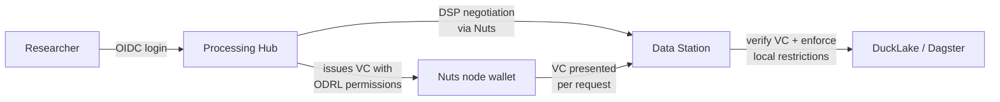
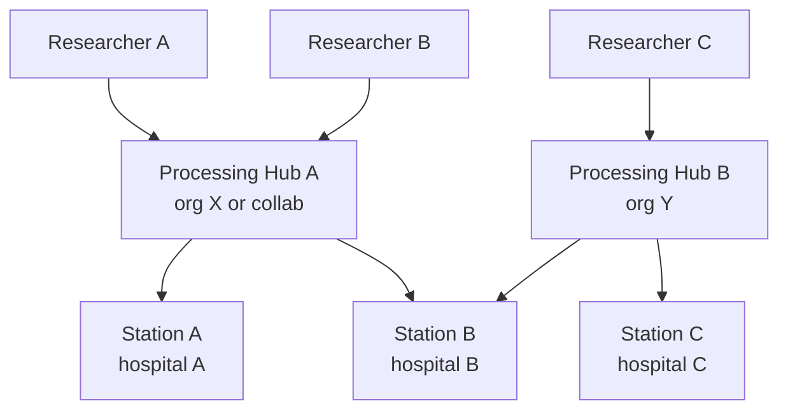

# ADR-007: Dataspace Protocol, authentication, and authorization architecture for pluginlake

**Status:** Proposed
**Date:** 2026-05-28

## TL;DR

**What this ADR decides:**

How pluginlake data stations and processing hubs authenticate, authorize, and exchange data in a federated multi-hospital network, compliant with EHDS, Health-RI, and the Eclipse Dataspace Protocol.

**Key questions answered:**

| Question | Decision |
|---|---|
| How do nodes identify each other? | **Nuts** (decentralized identity, org-level credentials via DIDs) |
| How are data access terms negotiated? | **DSP contract negotiation** (bilateral, station must approve) |
| How are per-user permissions expressed? | **Verifiable Credentials with ODRL profile** (issued by hub, verified by station) |
| Who has final authority over data? | **Always the data station** (can deny/restrict regardless of credential claims) |
| How are permissions enforced at query time? | **Built-in ODRL profile evaluator** (no OPA, no external policy engine) |
| How do abstract permissions map to real data? | **Station-local asset + operation registry** (YAML config per station) |
| What happens after a contract is agreed? | **Per-request VC presentation** (no re-negotiation needed per query) |

**Architecture in one diagram:**

Per-request calls carry two layers: the Nuts DPoP-bound access token in the `Authorization` header (proves org identity, boundary 2) and the PluginlakeAccessCredential as a VP in the request body or a dedicated header (proves user permissions, boundary 3).

**Delivery phases:**

1. **Phase 1:** DSP routes + Nuts identity + contract negotiation (single hub ↔ single station)
2. **Phase 2:** VC-based per-user credentials + ODRL evaluation + enforcement layer (multi-hub)
3. **Phase 3:** Dashboards + RBAC + collaboration governance (production network)

---

## Terminology

### General concepts

| Term | What it is |
|---|---|
| **DID** (Decentralized Identifier) | A globally unique identifier (like a URL) that an organization controls itself — no central registry needed. Each pluginlake instance has its own DID. |
| **Credential** | A digitally signed statement about a subject. Example: "Hospital X is a recognized PLUGIN participant with role station." |
| **Verifiable Credential (VC)** | A credential in a standard format (W3C) that anyone can verify without calling the issuer. Contains claims, a subject, an issuer, and a cryptographic signature. In pluginlake, a VC is the *container* that carries permissions from hub to station. |
| **Verifiable Presentation (VP)** | A wrapper that a holder uses to present one or more VCs to a verifier. The VP proves the holder actually controls the credential (not just copied it). |
| **Signature** | Cryptographic proof that a credential was issued by a specific DID and has not been tampered with. Verifiers check the signature against the issuer's public key. |
| **OIDC** (OpenID Connect) | Standard protocol for "log in with your institution." Handles usernames, passwords, MFA — the normal login experience. Used at boundary 1 only. |
| **Nuts** | Dutch healthcare identity network. Provides DID management, credential issuance, and VP exchange between organizations. Handles boundary 2 (org-to-org trust). |
| **DSP** (Dataspace Protocol) | Eclipse standard for how two organizations negotiate data access. Defines catalog browsing, contract negotiation, and data transfer as HTTP message exchanges. |
| **ODRL** (Open Digital Rights Language) | A W3C standard for expressing permissions and constraints ("user X may read columns A,B of dataset Y where region=NL"). Used inside VCs for boundary 3. |
| **Contract / Agreement** | The result of a successful DSP negotiation. Both parties store a copy. It defines what is allowed in principle — individual requests are still verified against it. |
| **Permission** (ODRL) | A specific rule inside a VC that says "user X may perform action Y on asset Z subject to constraints." The atomic unit of authorization at boundary 3. |
| **DPoP** (Demonstration of Proof-of-Possession) | A mechanism that binds an access token to a specific key pair, preventing token theft. Each request includes a fresh proof that the caller holds the private key. |
| **Bolt** | A Nuts "use case definition" — a configuration that says which credentials are required for a specific interaction pattern (e.g. pluginlake data access). |

**How they relate:** A DSP contract sets the outer bounds ("hub and station agree to collaborate"). The hub then issues VCs to its researchers — each VC contains one or more ODRL permissions scoped within the contract's bounds. The station verifies the VC signature and evaluates each permission against the request.

### pluginlake-specific terms

**Three trust boundaries:**

- **Boundary 1 (user → hub):** Who is this researcher, what are they allowed to request? Internal to the hub.
- **Boundary 2 (hub → station, hub → hub):** Is this node a known, trusted participant in the network with the correct role? First protection layer — rejects unknown orgs and wrong-role requests before any data logic runs. Enforced by Nuts.
- **Boundary 3 (transaction enforcement at the station):** For this specific request: which datasets, which compute operations, which columns, which row filters, which privacy constraints? Fine-grained enforcement via DSP agreement + ODRL credentials.

| Term | Meaning |
|---|---|
| **Nuts VP** | Verifiable Presentation containing `NutsOrganizationCredential`. Used for org-to-org authentication (trust boundary 2). |
| **PluginlakeAccessCredential** | A Verifiable Credential containing ODRL permissions. Issued by the hub, presented per-request, verified by the station. Proves per-user authorization (trust boundary 3). |
| **Scoped transfer token** | A short-lived bearer token issued after a transfer completes. Grants access to `GET /dsp/data/{transfer_id}` to pull result data. Not a VC. |
| **DSP Agreement** | The bilateral contract between hub and station after successful negotiation. Stored in Postgres. Sets outer bounds for all subsequent requests. |
| **ODRL profile** | pluginlake's constrained subset of ODRL. "Level 2" means: fixed set of actions, constraint types, and asset URN scheme; no arbitrary policy expressions. |

---

## Normative references

- **Health-RI Data Station Specification** (working document, public consultation planned 2026): defines the architecture for data stations and processing hubs for secondary use of health data in the Netherlands. PLUGIN is listed as an implementation. See: https://health-ri.github.io/data-station-specification/en/
- **Eclipse Dataspace Protocol (DSP) 2025-1**: ISO-track specification defining Catalog Protocol (DCAT + ODRL), Contract Negotiation Protocol, and Transfer Process Protocol. See: https://eclipse-dataspace-protocol-base.github.io/DataspaceProtocol/2025-1-err1/
- **EHDS Regulation (EU) 2025/327**: entered into force 26 March 2025. Defines data holders, data users, Secure Processing Environments (SPE), and the Health Data Access Body (HDAB). See: https://eur-lex.europa.eu/legal-content/EN/TXT/?uri=celex%3A32025R0327
- **Nuts specification (RFC003, RFC014, RFC022)**: Dutch decentralized identity and authorization for healthcare. See: https://nuts-foundation.gitbook.io/drafts/
- **TEHDAS2**: technical specifications for Data Access Application Management System (DAAMS) for Health Data Access Bodies. See: https://tehdas.eu/

---

## Context

pluginlake is a federated clinical data platform where data stations (hospitals with OMOP data and compute) and processing hubs (aggregation, statistical integrity, federated learning orchestration) form a network. This architecture implements the data station and processing hub concepts as described in the Health-RI Data Station Specification.

Key architectural properties:

- A pluginlake instance is the same software regardless of whether it is a data station or a processing hub. What differs is configuration: which Dagster assets are registered, which DSP role the instance plays (provider vs consumer), which routes are exposed, and which side of a contract the instance is on (issuing credentials vs verifying them). Nuts credentials also differ: both hold a `NutsOrganizationCredential`, but the network role (hub vs station) determines what a node is allowed to do at the Nuts level (e.g. only hub DIDs can initiate data requests to stations). Fine-grained per-user permissions are handled by the PluginlakeAccessCredential (ODRL), not by Nuts.
- Both hubs and stations have local users (researchers on hubs, data stewards on stations). A researcher belongs to a single hub. Multiple hubs can talk to the same station.
- A single organization may run both a data station and a processing hub.

### Authentication mechanisms per trust boundary

| Boundary | Auth mechanism | Why |
|---|---|---|
| User → Processing Hub (web UI) | PLUGIN OIDC provider (bundled with hub, supports institutional IdP federation and direct login) | Uniform across the network; researchers don't need Nuts awareness |
| User → Processing Hub (programmatic) | API key with OIDC pre-auth | Flexibility for client/CLI workflows |
| Processing Hub → Data Station | Nuts vp_token-bearer (org-to-org) | Fully decentralized, inter-organizational |
| Data Station → Processing Hub (results) | Nuts vp_token-bearer | Same as above, reverse direction |

---

## Decision

Implement DSP 2025-1 HTTPS bindings on the existing FastAPI gateway. The authentication and authorization architecture uses a layered approach where each trust boundary is handled by a dedicated system with no overlapping responsibility.

### Scope for Phase 1

**Provider (data station) only.** pluginlake implements the DSP provider surface: catalog, negotiation acceptance, and transfer execution. The hub-side DSP consumer/client is delivered in Phase 2 alongside per-user credentials.

**Pull transfer only.** After a Dagster job completes, the consumer receives a scoped endpoint URL and token to pull data from DuckLake.

### Adopted approach: Nuts + ODRL (VC-native, no OPA)

Five options were evaluated. The adopted architecture is a VC-native ODRL approach that eliminates OPA entirely:

| Criterion | A: Nuts+OPA | B: OPA only | C: Nuts only | **D: Nuts+ODRL (adopted)** | E: API keys |
|---|---|---|---|---|---|
| NL health ecosystem interop | ✓ | ✗ | ✓ | **✓** | ✗ |
| Per-user audit at station | ✓ | ✓ | ✗ | **Partial** (Phase 1 logs org-level only; Phase 2 adds per-user via VC) | ✗ |
| Compute constraints | ✓ | ✓ | ✗ | **✗** (not yet implemented: requires formal query/compute approval process) | ✗ |
| EHDS compliance | ✓ | Partial | Partial (org identity yes, per-user controls missing) | **✓** | ✗ |
| DSP standards compliance | ✓ | ✓ | ✓ | **✓** | ✗ |
| Decentralized identity | ✓ | ✗ | ✓ | **✓** | ✗ |
| Operational complexity | High | Medium | Low | **High** | Low |
| Custom token format needed | Yes | Yes | No | **No** | No |
| External dataspace interop | ✓ | ✗ | ✓ | **✓** | ✗ |

### Technology stack

| Layer | Tool | Role |
|---|---|---|
| Node identity | Nuts (DID + Verifiable Credentials) | Org-to-org trust |
| Protocol | DSP 2025-1 (FastAPI, Pydantic) | Catalog, negotiation, transfer |
| User permissions | PluginlakeAccessCredential (ODRL profile) | Per-user, per-dataset, per-operation |
| Enforcement | Built-in evaluator module (Python) | Maps ODRL → constrained queries/computations |
| Privacy | Post-execution validation (processing hub for aggregate operations) | k-anonymity, cardinality limits |
| VC crypto | PyJWT + cryptography | Sign/verify credentials |
| Data transfer | DuckLake pull + fastapi (HTTP + scoped token) | Actual data, outside DSP messages |

### Tooling decisions

| Component | Tool | Rationale |
|---|---|---|
| ODRL profile evaluation | Custom pluginlake module | No production-grade Python library exists. Constrained profile is small enough to evaluate directly. |
| VC signature verification | PyJWT + cryptography | Production-grade, well-maintained. |
| JSON-LD processing | Pydantic (primary) + pyld (optional) | Pydantic handles compacted JSON-LD. `pyld` added later if external connectors send expanded form. |
| Nuts node client | Auto-generate from OpenAPI spec | Use `openapi-python-client` to generate typed Python client. |
| DSP protocol implementation | Build: Pydantic models + FastAPI routes | No reusable Python DSP library exists. |
| Privacy checks | custom pluginlake assets | Simple post-query validation. |
| Policy storage | Pydantic Settings + YAML | Station-local config. No external policy engine. |

---

## Consequences

- pluginlake gains a DSP-compliant external surface aligned with Health-RI and EHDS
- Every station runs three sidecars: Nuts node, PostgreSQL server and Dagster code server. OPA is not required.
- The pluginlake ODRL profile (credential schema + actions + constraint types) is the highest priority deliverable
- Hub signing key distribution must be resolved (DID document, DSP negotiation, or discovery parameters)
- Station asset registry and operation registry must be defined per station (YAML config)
- Collaboration hubs need a governance decision on organizational identity before deployment
- New modules required: `src/pluginlake/authz/` and `src/pluginlake/dsp/`
- Streamlit UI gets new pages: credential management (central) and access control (datastation)

---

## Security invariants

These hold across all phases, including the placeholder middleware used while station internals are built first:

- **Single enforcement point (PEP):** No request reaches station compute (Dagster, DuckLake, PostgreSQL) except through one mandatory authn/authz enforcer. Every route, including `POST /api/assets/{key}/materialize`, catalog routes and any local admin path, passes through it. No request is served without authn/authz.
- **Network perimeter:** The station cluster and its services are isolated from outside contact. Only curated, explicitly exposed endpoints are reachable. Internal services (Nuts node, PostgreSQL, Dagster) are never directly accessible from outside the wall.
- **Transport independence:** If FastAPI is later replaced by a leaner protocol or service mesh, enforcement stays in the proxy or sidecar so no transport can bypass the PEP.
- **Layer separation:** Nuts governs machine-to-machine network membership and coarse machine roles (hub, analytics, ml) only. Fine-grained, user-based, contract-scoped access lives in the separate authz layer on top, because Nuts does not provide that granularity.

---

## Design risks by severity

| Risk | Severity | Blocker? |
|---|---|---|
| ODRL profile not standardized → stations incompatible | High | Yes, must define before multi-org deployment |
| Hub signing key distribution mechanism undefined | Medium | Must resolve before implementation |
| Custom ODRL evaluator correctness (no reference impl) | Medium | Mitigate with comprehensive test suite + DSP Technology Compatibility Kit (TCK) |
| Collaboration hub credential issuance → governance gap | Medium | Must resolve per collaboration |
| No existing Bolt (DSP reusable policy template) for research data exchange | Medium | No, ship as default policy file |
| Sensor reliability for outbound DSP callbacks | Medium | No, mitigatable with retry tracking |
| Nuts node per station requires outbound network | Medium | Verify per hospital firewall policy |
| No prior Nuts + DSP + ODRL implementation as reference | Medium | Budget extra integration testing time |
| Credential re-issuance cost for permission changes | Medium | Mitigate with short-lived VCs + automated issuance |

---

## Open questions

### Must resolve before implementation

1. **Pluginlake ODRL profile specification** — define the exact actions (`pluginlake:aggregate`, `pluginlake:query`, `pluginlake:count`, `pluginlake:compute`), constraint types, and asset URN scheme (`urn:pluginlake:dataset:{name}`).
2. **PluginlakeAccessCredential schema** — the VC type, required fields, issuer rules, how ODRL permissions are embedded. Candidate for ADR-008.
3. **Hub signing key distribution** — how stations learn to trust hub signing keys. Likely: hub's DID document contains the signing key.
4. **Collaboration hub credential issuance** — governance decision per collaboration.

### Deferred to ADR-008: Contract-to-compute mapping and query safety

5. Structured filter AST and query parameterization
6. Pre-approved algorithm and container registry
7. Privacy validation for non-aggregate queries
8. Station-side credential/role synchronization
9. Collaboration governance and trust boundary separation
10. Techniques to limit destructive or data-exfiltrating operations

### Can resolve during implementation

11. **OIDC provider selection** — Keycloak (mature, heavy) vs Authentik (lighter, Python-based) as bundled identity provider for boundary 1. Must support upstream IdP federation (SURFconext, Entra ID) and direct login.
12. ODRL profile extensions (versioned, additive)
13. Discovery service definition (JSON, ship as default)
14. Negotiation timeout (operational decision)
15. Credential validity duration (start with 24-hour VCs)
16. Processing hub specification alignment (contribute to Health-RI §4.4)
17. Processing hub DSP client implementation (Phase 2)
18. **Service-to-service transport** — investigate replacing FastAPI with a leaner protocol or service mesh for internal node-to-node traffic, keeping enforcement in a proxy or sidecar so no transport bypasses the PEP.
