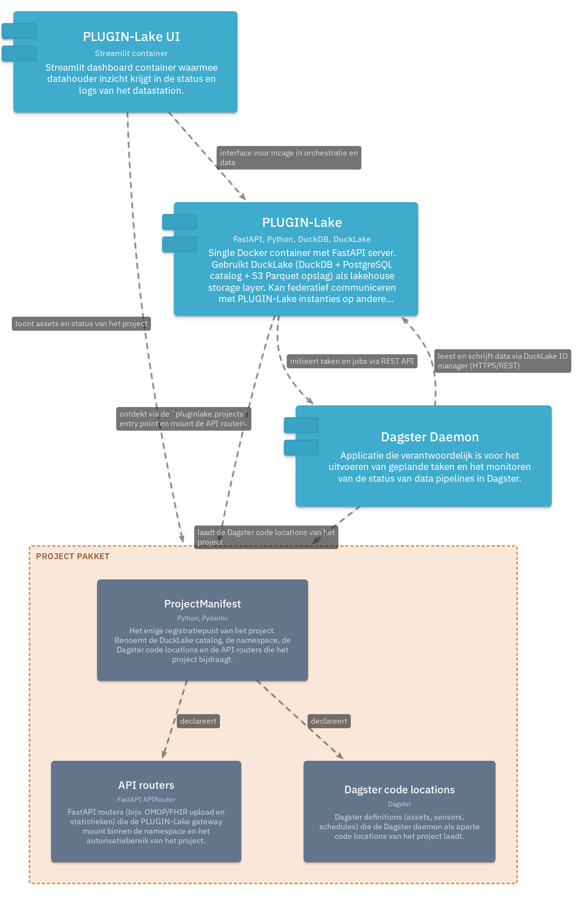

# Deploying a station

A pluginlake **station** is the standardized platform (PostgreSQL, Dagster, the FastAPI gateway, and the dashboard) plus one or more **projects** that provide the domain logic. The platform is the same everywhere; each deployment differs only in which projects it runs. This guide shows how projects are onboarded and how to bring a station up.

## How onboarding works

Projects plug into a station through a single entry point — no files are copied or edited by hand (ADR-009).



1. A project package declares a `ProjectManifest` and registers it on the `pluginlake.projects` entry-point group in its `pyproject.toml`:

    ```toml
    [project.entry-points."pluginlake.projects"]
    ehds-demo = "ehds_demo.manifest:manifest"
    ```

    The manifest names the project's DuckLake catalog, its asset namespace, and the Dagster code locations and API routers it contributes.

2. The operator lists the projects to deploy in a `pluginlake.toml` station config.

3. `pluginlake up` reads that config, installs the listed projects into the standardized images at container start, and core **discovers** them via the entry point — mounting their code locations in Dagster and their routers on the API gateway automatically.

Because wiring happens at install time through the entry point, the platform image never has to know about any specific project ahead of time.

## The station config

`pluginlake.toml` is the operator-owned deployment surface. Each project is either a local checkout (`path`, for development) or a pinned install spec (`source`, for production):

```toml
[station]
endpoint_url = "http://localhost:8000"

[[projects]]
name = "ehds-demo"
# Dev: a local sibling checkout, mounted and editable-installed into the images.
path = "../pluginlake-ehds-demo"

# [[projects]]
# name = "ehds-demo"
# Prod: a pinned spec, no local checkout needed.
# source = "pluginlake-ehds-demo @ git+https://github.com/plugin-healthcare/pluginlake-ehds-demo@v0.1.0"
```

Exactly one of `path` or `source` must be set per project. See `src/pluginlake/deploy/config.py` for the full schema.

## Bring the station up

From a core checkout, with the projects available at the paths in `pluginlake.toml`:

```bash
uv run pluginlake up -d
```

This builds the images, starts the stack, installs the configured projects, and wires their contributions. Once it is healthy:

| Service | URL |
|---------|-----|
| Dashboard (Streamlit) | http://localhost:8501 |
| Dagster (pipelines and assets) | http://localhost:3000 |
| API docs (Swagger) | http://localhost:8000/docs |
| API health | http://localhost:8000/health |

Verify that the configured projects conform to the plugin contract and are wired correctly:

```bash
uv run pluginlake verify
```

Stop the station (add `-v` to also remove volumes):

```bash
uv run pluginlake down
```

## Onboarding a new project

Scaffold a conformant project package, implement its assets and routers, then add it to `pluginlake.toml`:

```bash
uv run pluginlake init my-project
```

Add a `[[projects]]` entry pointing at the new checkout (or its pinned source) and run `pluginlake up` again. The `pluginlake-ehds-demo` repository is a complete worked example of a project package.
