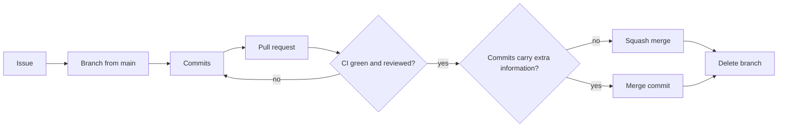

# GitHub flow

How a change gets from an idea to `main`.
The repository uses GitHub Flow: one long-lived branch (`main`) and short-lived branches for every change.

## Steps

1. Pick or create an issue on the project board.
2. Create a branch from an up-to-date `main`, named `<category>/<description>`.
3. Make small, focused commits.
4. Run the checks locally with `just ci`.
5. Push the branch and open a pull request against `main`.
6. Link the issue through the Development panel of the pull request.
7. Wait for CI and address review comments with new commits on the same branch.
8. Merge once CI is green and the review is resolved, using the method from the next section.
9. Delete the branch.

## Merge method

| Pull request | Method |
|--------------|--------|
| Dependabot and grouped dependency updates | Squash |
| `feat`, `fix`, `docs`, `build` where the end state says everything | Squash |
| `feat`, `fix`, `docs`, `build` where the individual commits explain things the end state does not | Merge commit |

Choose a merge commit only when the commit history holds information that the final diff does not.
Do not keep long-running branches.
If a large change needs a shared feature branch, keep it short-lived and merge it back into `main` often.

## Branch names

| Category | Use for | Example |
|----------|---------|---------|
| `feat` | New functionality | `feat/cli-module` |
| `fix` | Bug fixes | `fix/port-mismatch` |
| `docs` | Documentation only | `docs/adrs-changelog` |
| `build` | Dependencies and tooling | `build/bump-polars` |

## Linking issues

Link the issue to the branch or pull request through the Development panel on GitHub.
Do not use closing keywords such as `Closes #123` in the pull request body.
The project board closes the issue based on the status of the linked pull request.

## Dependency updates

Dependabot opens pull requests for dependency and GitHub Actions updates.

1. Merge pull requests that are clean and have green checks.
2. Group the remaining ones into a single pull request when they conflict on `uv.lock`.
3. Run `just ci` on the grouped branch before opening it.

## Documentation changes

Documentation changes go through the same flow.
Run `just docs` to preview the site and `just docs-lint` to check the markdown.
Merging to `main` deploys the site to GitHub Pages.

## Releases

Releases are tagged commits on `main`.
See [Release process](../development/develop-guidelines.md#release-process) for the steps.
