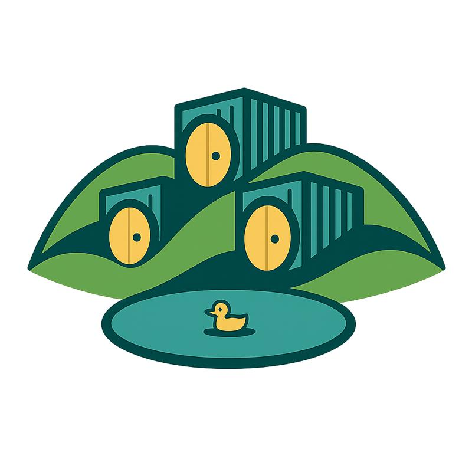

---
hide:
  - navigation
  - toc
  - title
---

Local-first healthcare data platform built on DuckLake, Dagster, and FastAPI.
Designed for clinical data exchange and reuse across hospital networks.

### [Guides](guides/index.md)
Installation, deployment, API usage, and step-by-step tutorials to get started.

### [Reference](reference/index.md)
Python library documentation covering configuration, storage, OMOP, and core modules.

### [Decisions](decisions/README.md)
Technical decisions and rationale behind the platform architecture.

### [Development](development/index.md)
Contribution guidelines, code style, and planned future features.

