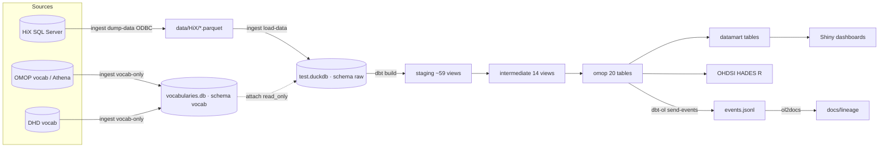

# SEIN-OMOP repository review — reusability and pluginlake integration

- **Date:** 2026-08-04
- **Scope:** the full SEIN-OMOP codebase (dbt project, `sein_dagster`, `src/utils` ingest/ol2docs tooling, `docs/lineage`) reviewed against the architecture and ADRs of **pluginlake** (`~/code/pluginlake`).
- **Goal:** determine what is reusable, the strong/weak points in flows and setup, whether SEIN-OMOP fits as a standalone Dagster code location or (partly) belongs in pluginlake's core package, and how dbt can be integrated as a base option on **DuckLake** with **OpenLineage**.

## 1. Executive summary

SEIN-OMOP is a **HiX → OMOP CDM v5.4 ELT pipeline** built on dbt-duckdb + dagster-dbt, with a custom Python ingestion layer and a home-grown OpenLineage → Markdown documentation generator (`ol2docs`). pluginlake is a **generic data-station platform** (FastAPI + Dagster + DuckLake + Polars) that currently treats OMOP as a *direct input format* (Synthea-style CSVs), not as the output of a complex source-system mapping.

The two projects are complementary, not competing: SEIN-OMOP supplies the HiX-specific transformation logic pluginlake lacks; pluginlake supplies the generic orchestration, storage (DuckLake) and lineage standard (OpenLineage) SEIN-OMOP lacks.

**Core verdict:** the dbt transformation layer is the strongest and most reusable component — well-layered, consistently named, reasonably documented and tested. It should be **kept and adopted almost as-is**. The orchestration (`sein_dagster`), the ingestion CLI, and the standalone doc generator re-implement things pluginlake already solves (IO manager, DuckLake, lineage) in an incompatible way (loose `.duckdb` files instead of a DuckLake catalog, no OpenLineage↔Dagster run linkage) and should **not** be carried over unchanged. A handful of concrete data-quality and test-hygiene issues (non-deterministic joins, broken relationship tests, an unused test package, doc/SQL mismatches) should be fixed regardless of the pluginlake decision.

| Aspect | Verdict | Reusable for pluginlake |
|---|---|---|
| dbt transformations (staging → intermediate → omop) | Strong | Yes, largely as-is |
| dbt macros (surrogate keys, schema, datetime) | Strong | Yes |
| Dagster orchestration (`@dbt_assets`) | Good basis, classic pattern | Yes, once pointed at DuckLake |
| Ingestion layer (`ingest.py`) | Functional, HiX-specific | Partly — pattern is reusable, code is not |
| Lineage docs (`ol2docs.py` + OpenLineage) | Distinctive, valuable | Yes, as a documentation layer alongside a real lineage backbone |
| Setup/environment (loose DuckDB files, `just`) | Works locally, not lake-ready | No — replace with DuckLake |

## 2. Architecture & flows



- The pipeline is a textbook ELT layering (`raw → staging → intermediate → omop → datamart`) with strict `ref()` discipline and clear naming conventions (`stg_<source>__<entity>`, `int_*`, uppercase OMOP tables).
- Two physical DuckDB files: `test.duckdb` (transformations) and `vocabularies.db` (read-only attached). This is the heart of the "local-first" design choice, and simultaneously the main blocker toward a shared, multi-station lakehouse.
- Orchestration (`sein_dagster`) is effectively a single `@dbt_assets` function that runs `dbt build`; ingestion and doc generation live outside Dagster, invoked via `just` recipes.

## 3. Strong points (keep)

| Strength | Evidence |
|---|---|
| Clear, consistent layered dbt architecture — one responsibility per layer, predictable naming, `ref()` used everywhere | `dbt/models/{staging,intermediate,omop,datamart}`, per-layer materialization in `dbt_project.yml` |
| Clean separation of source-specific rename/clean (staging) vs. business logic/concept mapping (intermediate) vs. CDM output (omop) | `staging/hix/*` (16), `staging/ohdsi/*` (9), `staging/dhd/*` (34), `intermediate/int_*` (14), `omop/*.sql` (20) |
| Reusable, storage-agnostic macros: `generate_int_surrogate_key` (namespaced via `object_name` to avoid cross-table key collisions, trims Windows line-ending artifacts, propagates NULL instead of hashing to a fake key), `generate_schema_name` (custom schema without target prefix), `make_datetime` | `dbt/macros/generate_int_surrogate_key.sql`, `generate_schema_name.sql`, `make_datetime.sql` |
| Rich column documentation with ETL decisions captured explicitly in `.yml` (e.g. fallback to `concept_id = 0`, hardcoded nulls, mapping rules) — this is exactly the domain knowledge that is most expensive to rebuild | `dbt/models/omop/PERSON.yml` and similar files |
| Tested with `dbt_utils`: `unique`, `not_null`, `relationships` to vocabulary tables | per-model `schema.yml`/`.yml` files |
| Domain-specific data quality test: a singular test that only allows PROMIS total scores for complete responses | `dbt/tests/promis_total_score_only_for_complete_responses.sql` |
| Thoughtful custom-vocabulary extension: `SEIN_QSTN` vocab cleanly integrated via a dedicated staging + intermediate union, without polluting the OHDSI vocabulary | `dbt/models/intermediate/int_concepts_with_custom_vocab.sql` |
| OpenLineage integration already present via `dbt-ol` (`openlineage-dbt`), generating usable, versionable Markdown lineage docs | `openlineage.yml`, `src/utils/ol2docs.py`, `docs/lineage/` |
| DuckDB attach pattern for a read-only vocabulary catalog, separating vocab from clinical data — conceptually similar to pluginlake's `omop_vocab` schema | `dbt/profiles.yml` (`attach: vocabularies.db as vocab, read_only`) |
| Reproducible developer experience: the `justfile` bundles the whole lifecycle (setup, load, build, docs, status) with clear recipes | `justfile` |
| `dagster-dbt`'s standard `@dbt_assets` pattern (manifest-driven asset graph) instead of a hand-rolled orchestration layer | `sein_dagster/sein_dagster/assets.py` |

## 4. Weak points & risks

### 4.1 Data correctness (verified in code)

- **Non-deterministic visit linkage.** Several OMOP models link a visit via `row_number() over (partition by person_id, visit_start_date)` and filter `rownum = 1` **without an `ORDER BY` tie-break**. DuckDB does not guarantee row order for ties, so the selected visit can change between runs. Confirmed in `dbt/models/omop/CONDITION_OCCURRENCE.sql:13` and present in the same pattern in `DRUG_EXPOSURE.sql`, `OBSERVATION.sql`, `NOTE.sql`, `SURVEY_CONDUCT.sql`.
- **Broken/dead relationship tests.** Multiple `.yml` files declare `relationships` tests against `ref('CARE_SITE')` and `ref('VISIT_DETAIL')`, but **neither model exists** in `dbt/models/omop/` (confirmed: no `CARE_SITE.sql`/`VISIT_DETAIL.sql` in the directory listing). This test will fail dbt's ref resolution or, if silently excluded from a partial run, silently stop validating the relevant columns. Affects `PERSON.yml`, `PROVIDER.yml`, `VISIT_OCCURRENCE.yml`, `CONDITION_OCCURRENCE.yml`, `DRUG_EXPOSURE.yml`, `NOTE.yml`, `OBSERVATION.yml`.
- **Hardcoded/imputed clinical values without guardrails.** E.g. a default drug-exposure duration and multiple `concept_id = 0` fallbacks in `dbt/models/intermediate/int_drug_exposure_with_concepts.sql` and `int_locations_with_concepts.sql`. These are documented in the `.yml` notes (a genuine strength, see §3) but are not covered by tests that would catch an unexpectedly high fallback rate.
- **Brittle questionnaire parsing.** Regex-heavy text splitting in `dbt/models/intermediate/int_observation_from_questionnaires.sql` is sensitive to new source formats — this is a critical path for PROMs data.

### 4.2 Tests & documentation

- **`dbt_expectations` is declared but unused.** It is pinned in `dbt/packages.yml` but no model or test references it anywhere in `dbt/models/` — a dead dependency that should either be used (per the original integration plan for extra data-quality tests) or removed.
- **Doc–SQL mismatches.** For example, some `.yml` notes describe a column as a hardcoded null while the corresponding `.sql` passes the value through from an intermediate model (spot-checked on `PERSON`). Wherever the ETL-note commentary is the main source of transformation documentation (see §3), any drift here is costly because there's no automated check that the note matches the code.
- **Uneven test coverage.** `omop/` is reasonably well tested; `staging/`/`intermediate/` models mostly carry descriptions without `data_tests`. For a clinical pipeline this is a silent-data-drift risk further upstream than the final CDM tables.
- **Documentation drift between AGENTS.md and the dbt project.** AGENTS.md documents 18 omop models (8 vocabulary + 10 clinical), but `dbt/models/omop/` contains 20 `.sql` files (e.g. `LOCATION`, `PROVIDER`, `DRUG_STRENGTH`, `RELATIONSHIP`, `SURVEY_CONDUCT` are not accounted for in that split). Minor today, but matters once this becomes a shared/external contract.
- **No CI gate on dbt.** The only GitHub Actions workflow (`.github/workflows/docs.yml`) builds the documentation site; `dbt build`/`dbt test` never run automatically. Model or test regressions are not caught before merge.

### 4.3 Setup / environment

- **Tight coupling to local DuckDB files, no DuckLake.** `dbt/profiles.yml` hardcodes `path: ../duckdb/test.duckdb`, and `sein_dagster/sein_dagster/resources.py` hardcodes the same paths again. No catalog, no versioning, no copy-on-write, no storage shared between stations — this is the central blocker for pluginlake adoption (its ADR-002/003 require DuckLake as the only storage path).
- **Duplicated, slightly divergent dependency pins.** `dbt-core`/`dbt-duckdb` versions are declared in both the root `pyproject.toml` and (historically) a `sein_dagster` project file, risking drift.
- **`DuckDBResource` is defined but not actually used in the asset flow.** `hix_to_omop_dbt_assets` only uses `DbtCliResource`; the custom `DuckDBResource` is injected in `definitions.py` but never called from the asset function.
- **`DuckDBResource.get_table_metadata` builds SQL via f-string interpolation of the schema name.** Low risk (internal, trusted caller), but inconsistent with the rest of the codebase's use of parameterized refs — easy to fix.
- **SQL/path string interpolation in ingestion.** File paths are interpolated directly into DuckDB SQL calls (e.g. `read_csv_auto('{filepath}')`) in `src/utils/ingest.py`. Low risk locally (trusted paths), but not parameterized, and this pattern duplicates load/validation logic that pluginlake's `omop/loader.py` already implements more generically (for OMOP CSV, not HiX ODBC dumps — no direct functional overlap, but a duplicated pattern worth aligning on).

## 5. pluginlake: relevant existing decisions (ADRs)

- **ADR-001 (asset architecture):** pluginlake ships a core package with reusable assets, bundled per data model under `pluginlake.definitions.*`. Every data station is a **Dagster code location** that either uses such a definitions module directly, or composes its own module importing pluginlake assets. This is exactly the pattern a dbt-based OMOP pipeline should fit into: **not a new, separate repo/code location next to pluginlake, but a module inside `pluginlake.definitions`** (e.g. `pluginlake.definitions.omop_dbt`, or an alternative option within `pluginlake.definitions.omop`).
- **ADR-002/003 (storage & DuckLake):** every asset is written via the Dagster IO manager to DuckLake as `CREATE OR REPLACE TABLE ducklake.<schema>.<table>`. No manual Parquet management, no alternative storage paths. dbt should therefore write **directly to the DuckLake catalog** — `dbt-duckdb ≥ 1.9.6` supports `attach: ducklake:postgres:...`, and SEIN-OMOP already pins `dbt-duckdb>=1.9.6,<1.10`, so this is technically compatible without a version bump.
- **ADR-007 (column-level lineage):** explicitly states that pluginlake currently uses **no dbt** ("Transformations are Dagster assets with Polars/DuckDB"), and that dbt-oriented static-analysis tools (Altimate) therefore don't fit the current Polars assets. But the ADR also explicitly concludes: *"dbt lineage comes for free if data stations adopt it"* via `openlineage-dbt`, and notes that the `duck_lineage` DuckDB extension has **explicit DuckLake support**. This is the direct technical path for SEIN-OMOP: if dbt models run against the DuckLake catalog, pluginlake gets column-level lineage for those models "for free", without needing the custom `@track_lineage` decorator that ADR-007 designs specifically for the Polars side.

## 6. Code location vs. core package: the answer

**Not entirely a standalone code location, and not entirely inside core — a third form: dbt as an optional transformation engine inside pluginlake's core, exposed through its own definitions module.**

Today, SEIN-OMOP's orchestration is already **entirely isolated as its own code location** (`sein_dagster`): the root `pyproject.toml` has no `[tool.dagster]` section, only the CLIs (`ingest`, `ol2docs`) and the dbt project live there; `sein_dagster` is installed separately as an editable package and references the dbt project via a relative path (`sein_dagster/sein_dagster/project.py`). That isolation is the right instinct for a plugin, but two things need to change before it can slot into pluginlake:

1. **Loose coupling via relative file path → explicit, injectable config.** The code location currently finds the dbt project via `Path(__file__)/../../../dbt`, which assumes a specific repo layout. For a pluginlake plugin this must become configuration (env var or resource parameter), not a relative path.
2. **Classic `Definitions` + `@dbt_assets` → align with pluginlake's module structure.** Concretely:
   - **`pluginlake.core`** gains a new submodule, e.g. `pluginlake.core.dbt`, containing a `DbtProject`/`DbtCliResource` wrapper that reuses the DuckLake attach string from `pluginlake.core.ducklake.setup` (same Postgres catalog, same storage backend) instead of SEIN-OMOP's own `profiles.yml` pointing at loose `.duckdb` files, plus the dbt project itself (macros, staging/intermediate/omop models), carried over from SEIN-OMOP largely unchanged, generalized enough that "HiX" is one source among potentially several that plug into the same staging pattern.
   - **`pluginlake.definitions`** gains a module (e.g. `pluginlake.definitions.omop_dbt`) exposing the dbt models via `dagster-dbt`'s `@dbt_assets`, **alongside** (not replacing) the existing Polars-based `omop` assets. Stations that prefer SQL/dbt transformations over Polars assets pick this module — exactly as ADR-001 prescribes ("stations pick a definition module").
3. This stays an **option within pluginlake as a package**, not a separate repo. SEIN-OMOP's HiX-specific ingestion (`ingest.py`, ODBC dump logic) stays separate — that is station-specific source code, not core functionality, and belongs in an external data-station repo that imports `pluginlake` (the "import and extend" path from ADR-001), together with a SEIN-specific `definitions` module combining the dbt option with a custom HiX ingestion asset.

## 7. Integration plan: dbt as a base option on DuckLake + OpenLineage

**What can be reused as-is:** all dbt models, macros, and seeds (transformation logic is storage-agnostic); the `@dbt_assets` orchestration as the plugin's foundation; `ol2docs` + the OpenLineage integration as a documentation layer.

1. **DuckLake attach for dbt.** Replace `dbt/profiles.yml`'s `path`-based target with an `attach` block pointing at `ducklake:postgres:<pluginlake dsn>` (the same Postgres catalog as pluginlake's `DuckLakeSettings`), plus the `ducklake` extension:

   ```yaml
   hix_to_omop:
     target: lake
     outputs:
       lake:
         type: duckdb
         extensions: [httpfs, parquet, ducklake]
         attach:
           - path: "ducklake:postgres:<connection>"
             alias: ducklake
             options:
               data_path: <shared lakehouse data path>
   ```

   Materializations (`view` for staging/intermediate, `table` for omop/datamart) keep working unchanged; DuckLake writes tables as Parquet + catalog metadata. Replace the read-only attach of `vocabularies.db` with the vocab tables as a schema in the same DuckLake catalog (or a second attach), removing the second loose-file dependency.

2. **Single write path.** dbt's `CREATE OR REPLACE TABLE`/`CREATE VIEW` against the DuckLake catalog is functionally identical to pluginlake's `DuckLakeIOManager.handle_output()` (`CREATE OR REPLACE TABLE ducklake.<schema>.<table>`). No separate IO manager is needed for dbt models — dbt is its own write path here, consistent with ADR-002's "single write path" principle as long as it targets the same catalog.

3. **Lineage as a platform backbone, not a local file.**
   - Point `openlineage-dbt` (already a SEIN-OMOP dependency) at the same local OpenLineage endpoint ADR-007 proposes, instead of today's `FileTransport` writing only to `docs/lineage/events.jsonl`, so dbt lineage lands in the same backend as the Polars side and Dagster lifecycle events. `openlineage.yml` already has the composite-transport template commented out for this purpose.
   - Load the `duck_lineage` extension in the dbt-duckdb connection (via `extensions:` in `profiles.yml`) for automatic column-level lineage straight from DuckDB's query plan, including DuckLake namespace resolution — this is exactly the "SQL path, zero-config" case ADR-007 describes.
   - `ol2docs.py` can keep existing as an optional, human-readable documentation generator, but should not be the primary lineage source once `duck_lineage` + the OpenLineage endpoint are live.

4. **Dagster coupling.** Replace `sein_dagster`'s own `DbtProject`/`DbtCliResource`/`DuckDBResource` with pluginlake's existing `DuckLakeSettings`/`setup_ducklake()` as the basis for the dbt connection string, and register the `@dbt_assets` function inside a new `pluginlake.definitions.omop_dbt` module instead of a separate `sein_dagster` package.

5. **Add a CI gate.** Add `dbt build`/`dbt test` to a GitHub Actions workflow (currently entirely absent) so model changes and test failures are visible before merge — independent of the pluginlake integration, and something SEIN-OMOP should have regardless.

6. **Fix the surrogate-key risk.** Add an explicit uniqueness/collision check on the generated hash columns (e.g. via `dbt_expectations.expect_column_values_to_be_unique`, now that the package is a declared but unused dependency, combined with a periodic collision-analysis query) instead of the current commented-out modulus with no replacement guarantee.

7. **Fix the correctness issues from §4.1 before or during migration.** DuckLake's snapshot isolation makes queries reproducible *per snapshot*, but the underlying `row_number()` tie-break for visit linkage still needs an explicit `ORDER BY` to be *correct*, not just reproducible. Fix the `CARE_SITE`/`VISIT_DETAIL` relationship tests (either build minimal placeholder models or remove the tests) so `dbt build` stops failing/silently skipping validation.

### Migration considerations / risks

- **HADES/R consumers connect directly to `duckdb/test.duckdb` today** (`R/HADES.rmd`). With DuckLake, the R connection must go through the DuckLake catalog/extension instead — test this before migrating.
- **Version pins.** SEIN-OMOP pins `duckdb>=1.4.0,<1.5` and `dbt-duckdb>=1.9.6,<1.10`; DuckLake needs a compatible DuckDB + extension version. Confirm compatibility and unify pins across the merged setup.
- **Concurrency & ACID.** DuckLake adds snapshot isolation/versioning that the current single-file setup does not have — a net positive, but worth validating against the R/HADES and dashboard read paths.

## 8. What we do not carry over

- `sein_dagster` as a separate package (`resources.py`/`project.py`/`definitions.py`) — replaced by integration into `pluginlake.core`/`pluginlake.definitions`.
- Loose `.duckdb`/`vocabularies.db` files as the storage model — replaced by the DuckLake catalog.
- `ol2docs.py` as the *source of truth* for lineage — stays optional as a documentation generator, not as the lineage system.
- `DuckDBResource.get_table_metadata`'s ad-hoc f-string SQL construction — replaced by pluginlake's existing DuckLake connection patterns.
- HiX-specific `ingest.py` (ODBC dump) stays outside pluginlake core; it belongs in an external data-station repo that imports pluginlake, not in the shared package.

## 9. Recommended priorities

| Priority | Action | Why |
|---|---|---|
| P1 | Fix non-deterministic visit joins (explicit `ORDER BY` tie-break) | Data correctness/reproducibility |
| P1 | Fix or remove `relationships` tests pointing at non-existent `CARE_SITE`/`VISIT_DETAIL` models | `dbt build` currently fails or silently skips validation |
| P2 | Proof of concept: `profiles.yml` on DuckLake + vocab inside the same catalog | Core step toward pluginlake integration |
| P2 | Composite OpenLineage transport (file + real endpoint), `duck_lineage` extension loaded | Lineage backbone for the platform, column-level lineage "for free" |
| P2 | Make the dbt project location and DB target configurable instead of a relative path | Prerequisite for reuse as a pluginlake module |
| P3 | Add a CI gate running `dbt build`/`dbt test` | Currently completely absent |
| P3 | Add staging/intermediate tests, or activate the already-installed `dbt_expectations` package | Data quality, remove a dead dependency |
| P3 | Add a collision check on the surrogate-key hash | Remove the unresolved risk left by the commented-out modulus |
| P3 | Unify dbt/duckdb dependency pins across the merged setup | Prevent version drift |
| P4 | Sync AGENTS.md/README model counts with the actual dbt project | Documentation drift |

## 10. Open questions for the team

- Should dbt models write to the same DuckLake Postgres catalog as the Polars assets, or to a separate DuckLake instance per "transformation style"? This affects schema naming and whether `int_*`/`stg_*` views should be visible in the catalog at all, or only the final `omop.*` tables.
- Should the generic HiX staging layer be made reusable for other source systems (a multi-source dbt project), or does dbt-in-pluginlake stay specific to SEIN/HiX stations with their own external dbt project?
- Priority of the CI gate (dbt build/test) — currently entirely absent — versus the larger DuckLake migration: the CI gate can be picked up independently and quickly.
